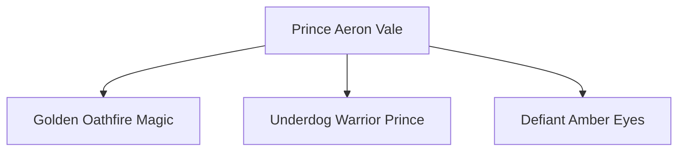

# 👑 Crown of the Last Dawn — Master Series Bible & Short-Form Video Production Pipeline

A complete, production-ready master blueprint and character model system for **Crown of the Last Dawn** — an original 60-episode fantasy-romance action manhwa series engineered for viral **YouTube Shorts** and **Instagram Reels**.

---

> [!CAUTION]
>
> ### 🚨 CRITICAL PRODUCTION RULES (NEVER DEVIATE — READ FIRST)
>
> 1. **100% VIBRANT FULL COLOR ONLY (ABSOLUTELY NO BLACK & WHITE / NO GREYSCALE SKETCHES)**:
>    - Traditional Japanese manga is historically printed in black-and-white, but **modern action manhwa and webtoons on AsuraScans, Reaper Scans, and Naver Webtoon are ALWAYS 100% VIBRANT FULL COLOR** (e.g., *Solo Leveling*, *Return of the Disaster-Class Hero*, *The Beginning After the End*).
>    - Every single panel, background, character, weapon, and magical effect must be rendered in rich, saturated, cinematic digital color from start to finish.
>    - **NEVER** generate or accept black & white, grayscale, pencil sketch, or monochrome ink drawings.
> 2. **ZERO COPYRIGHT STRIKES AUDIO (YOUTUBE MONETIZATION COMPLIANT)**:
>    - **DO NOT** use copyrighted commercial songs or phonk tracks that trigger YouTube/Meta Content ID claims or demonetization.
>    - Use studio-grade neural voiceover (`edge-tts`) as the dominant primary track (0dB).
>    - Use a custom-synthesized royalty-free subtle dark fantasy ambient score at low volume (`-22dB` / `0.12` volume) behind the voice.
> 3. **MANGA THOUGHT BANNERS & SPEECH BUBBLES**:
>    - Always overlay frosted-glass gold thought banners (`y=1430`) on video edits so viewers can read along with character inner monologues and dialogue.
> 4. **ALWAYS GENERATE BRAND NEW UNIQUE IMAGES (NEVER REUSE ACROSS CHAPTERS)**:
>    - Every single chapter must feature **8 brand new, unique, full-color manhwa panels** specifically portraying the scenes of that episode.
>    - **NEVER** reuse panels, crops, or backgrounds from previous chapters. Each chapter requires fresh visual storytelling.
> 5. **STRICT 3-FILE CLEAN DELIVERABLE POLICY**:
>    - Every `chapterX/` folder must contain strictly **3 clean files** (no intermediate clips or scratch files):
>      - `Crown_of_the_Last_Dawn_Chapter_X_Edit.mp4` (Full 9:16 Video with Voiceover + Thoughts + Ambient Score)
>      - `Crown_of_the_Last_Dawn_Chapter_X_Manhwa.pdf` (8-Page Full-Color Vertical Digital Webtoon Comic)
>      - `UPLOAD_GUIDE.md` (Copy-Paste YouTube Shorts & Instagram Reels Kit)

---

## 📖 Series Synopsis & World Lore

In a realm fractured by broken oaths, the disgraced first prince of Valedorn, **Aeron Vale**, is framed for the horrific massacre at Ember Pass and brought before the executioner's gallows. But when a shadow beast summons pitch-black crystalline miasma to slaughter an innocent child in the crowd, Aeron's iron chains ignite with legendary golden **Oathfire** — the ancient power born only when a sincere promise is kept in the face of death.

Together with **Lyra Dain**, the feared masked "Moonblade" warrior-princess of the enemy kingdom Nareth who arrives to assassinate the king, Aeron uncovers an insidious royal conspiracy orchestrated by Chancellor Malrec and an eldritch entity known as the **Hollow Crown**.

### Magic Systems & Artifacts:

- **Oathfire (Sun Aspect)**: Brilliant, blazing golden fire with molten white core. Awakens through selfless loyalty, unbreakable promises, and sacrificial courage. Incinerates shadow and heals mortal wounds.
- **Shadowglass (Void Aspect)**: Sharp, obsidian-violet crystalline spikes and black smoke created by betrayal, despair, and broken vows. Can infect living flesh, turning victims into mindless void puppets.
- **The Dawn Crown**: Ancient relic of unified peace. When the Sun Seal (Valedorn) and Moon Seal (Nareth) are united in selfless harmony, the Hollow Crown can be permanently shattered.

---

## 👥 Character Model Sheets & Visual Consistency Bible

To ensure 100% visual consistency across all 60 episodes and image generations, every character must strictly adhere to their designated **Model Sheet**, **Signature Color Palette**, and **Visual Prompt Formula**.

---

### 1. Prince Aeron Vale (The Disgraced First Prince)



- **Role**: Protagonist. Disgraced 1st Prince of Valedorn, framed traitor, fearless protector.
- **Archetype**: Defiant warrior prince, sarcastic charm hiding iron loyalty, relentless combat instinct.
- **Age / Build**: 22 years old, 6'1" (185 cm), athletic, battle-honed muscular build with sword-fighting scars.
- **Hair & Face**: Messy, textured raven-black hair with warm dark-brown undertones, sharp angular jawline, intense glowing amber-gold eyes, faint scar across left temple.
- **Signature Costume**: Tattered royal black-and-gold high-collar combat tunic, worn steel shoulder pauldron on right arm, blackened chainmail underlayer, heavy broken iron cuffs around wrists, rugged leather trousers and knee-high combat boots.
- **Weapon / Aura**: Blazing golden **Oathfire** erupting from his fists and runic broadsword; molten gold particle embers radiating outward.
- **Visual Prompt Formula**:
  > `athletic 22yo anime warrior prince, messy textured black hair with brown highlights, sharp jawline, glowing intense amber-gold eyes, wearing tattered black and gold royal combat tunic over chainmail, broken iron wrist shackles, blazing golden Oathfire flames swirling around fists and blade, dynamic action manhwa art style, cinematic high-contrast lighting, sharp webtoon lineart, 8k resolution`
  >

---

### 2. Princess Lyra Dain (The Masked Moonblade)

- **Role**: Female Lead / Deuteragonist. Warrior-princess of enemy kingdom Nareth, legendary assassin known as the "Moonblade".
- **Archetype**: Lethal, calculating, stoic assassin with an honorable warrior's code and razor-sharp intellect.
- **Age / Build**: 21 years old, 5'8" (173 cm), slender, highly agile acrobatic build, graceful and deadly.
- **Hair & Face**: Silky silver-white hair tied into a high battle ponytail with two face-framing bangs, piercing cold violet/ice-blue eyes, delicate porcelain skin.
- **Signature Costume**: Midnight-blue and obsidian leather stealth armor with polished silver crescent-moon filigree, hooded cowl draped over shoulders, ornate silver half-mask covering her nose and mouth (leaving her mesmerizing eyes visible).
- **Weapon / Aura**: Twin curved silver crescent daggers / Moonblades that emit a pale moonlight mist and silver slicing arcs.
- **Visual Prompt Formula**:
  > `stunning 21yo female anime assassin warrior princess, sleek silver-white hair in high ponytail, piercing cold violet-blue eyes, wearing ornate silver crescent half-mask covering lower face, fitted midnight-blue and polished silver stealth leather armor, holding twin curved silver Moonblade daggers emitting glowing pale cyan lunar mist, manhwa action webtoon art style, dynamic lighting, ultra detailed`
  >

---

### 3. Chancellor Malrec (The Shadow Architect)

- **Role**: Primary Antagonist. Royal adviser of Valedorn, secret cult leader of the Hollow Crown.
- **Archetype**: Aristocratic manipulator, cold sociopath, dark sorcerer hidden in plain sight.
- **Age / Build**: 48 years old, 6'2" (188 cm), tall, gaunt, predatory posture.
- **Hair & Face**: Slicked-back obsidian black hair with silver streaks at temples, sunken pale cheeks, cold serpent-like violet eyes, sinister subtle smirk.
- **Signature Costume**: Luxurious royal purple velvet high-collar ceremonial robes with intricate black-and-gold embroidery, high stiff collar, dark fur trim, black silk gloves.
- **Weapon / Aura**: A heavy jagged black crystal (Shadowglass) signet ring on his right hand leaking ominous violet-black smoke and crystalline needles.
- **Visual Prompt Formula**:
  > `sinister 48yo male fantasy chancellor, aristocratic, tall gaunt frame, slicked-back black hair with silver streaks, sunken cheeks, chilling serpent violet eyes, ornate purple velvet and gold royal robes, high stiff collar, glowing black shadowglass crystal ring emitting dark purple smoke, dark fantasy webtoon art style, dramatic menacing lighting`
  >

---

### 4. King Edric Vale (The Ailing Monarch)

- **Role**: Aeron & Mira's father, ruler of Valedorn.
- **Archetype**: Tragic noble king, weakened by mysterious shadow sickness, desperate to protect his children.
- **Age / Build**: 58 years old, weary, visibly weakened but maintaining royal dignity.
- **Hair & Face**: Flowing silver-white beard and mane, weathered regal features, warm but exhausted golden-brown eyes.
- **Signature Costume**: Heavy royal crimson-and-gold mantle with ermine fur lining, ceremonial Valedorn golden crown, clutching an ornate golden Sun Key pendant against his chest.
- **Visual Prompt Formula**:
  > `regal 58yo elderly fantasy king, dignified yet frail, flowing silver beard and hair, weathered aristocratic face, tired noble eyes, wearing heavy crimson velvet royal robe with ermine fur trim, golden sun crown, holding a radiant golden key pendant, solemn royal hall background, manhwa webtoon art style`
  >

---

### 5. Princess Mira Vale (The Hidden Strategist)

- **Role**: Aeron's younger sister, royal scholar and secret tactical mastermind.
- **Archetype**: Gentle and quiet on the surface, fiercely cunning, capable of lethal self-defense.
- **Age / Build**: 18 years old, 5'4" (163 cm), petite, elegant royal posture.
- **Hair & Face**: Dark wavy auburn hair elegantly pinned with golden hairpins, bright observant emerald-green eyes, gentle but determined expression.
- **Signature Costume**: Deep sapphire-blue and ivory silk royal court dress with wide sleeves concealing hidden wrist-dart mechanisms and throwing daggers.
- **Visual Prompt Formula**:
  > `elegant 18yo anime princess, dark auburn wavy hair styled with golden pins, sharp observant emerald green eyes, dignified expression, wearing refined sapphire blue and ivory silk royal gown with gold embroidery, subtle hidden wrist blade glint, royal palace interior, crisp manhwa art style`
  >

---

### 6. Prince Lucen Vale (The Manipulated Brother)

- **Role**: Aeron's younger brother, gifted royal swordsman poisoned by Malrec's lies.
- **Archetype**: Proud, conflicted prodigy seeking father's validation, jealous of Aeron's raw courage.
- **Age / Build**: 20 years old, 5'11" (180 cm), lean athletic swordsman build.
- **Hair & Face**: Neatly combed jet-black hair, aristocratic handsome face, conflicted steel-blue eyes.
- **Signature Costume**: Polished ceremonial white-and-gold knight plate armor with royal crest, pristine white cape, ornate golden dueling rapier.
- **Visual Prompt Formula**:
  > `handsome 20yo anime royal swordsman knight, neat jet black hair, conflicted steel blue eyes, aristocratic features, wearing pristine white and gold ceremonial plate armor with royal cloak, holding an ornate golden rapier, webtoon action art style, vivid high quality`
  >

---

### 7. Tobin Ash (The Loyal Blacksmith)

- **Role**: Aeron's childhood friend and legendary weaponsmith.
- **Archetype**: Loyal powerhouse, salt-of-the-earth giant, master craftsman who repairs ancient relics.
- **Age / Build**: 23 years old, 6'4" (193 cm), heavily muscled, broad shoulders, massive forearms with burn scars.
- **Hair & Face**: Shaggy dark brown hair, rugged bearded jaw, warm copper-brown eyes, soot-smudged face.
- **Signature Costume**: Heavy leather blacksmith apron over rugged canvas shirt, fingerless leather gloves, wielding a massive two-handed runic forge hammer.
- **Visual Prompt Formula**:
  > `muscular 23yo fantasy blacksmith giant, shaggy brown hair, rugged bearded jaw, warm copper eyes, soot smudges on skin, wearing heavy leather smithing apron over dark shirt, holding massive glowing runic forge hammer with flying orange sparks, dark forge background, action manhwa art style`
  >

---

### 8. Shadowglass Beasts & Void Fiends

- **Role**: Core monstrous cannon fodder and vanguard of the Hollow Crown.
- **Archetype**: Eldritch shadow chimeras born from dark miasma and broken oaths.
- **Appearance**: Quadrupedal predatory beasts resembling armored direwolves or shadowy panthers formed of churning pitch-black smoke and jagged obsidian crystal carapace, glowing sinister blood-red slit eyes, dripping violet caustic venom from fangs.
- **Visual Prompt Formula**:
  > `terrifying shadow beast monster, dark fantasy creature made of swirling pitch-black smoke and jagged obsidian crystal spikes, glowing demonic red eyes, snarling jaws with purple caustic energy dripping, shattering stone ground, dramatic action webtoon art style, high contrast, terrifying atmosphere`
  >

---

## 🎨 Visual Style Guide (AsuraScans / Modern Action Webtoon Standards)

> [!IMPORTANT]
> **FULL COLOR ONLY (NEVER Black & White)**:
> In accordance with the official AsuraScans and Korean action webtoon standards (*Solo Leveling*, *Omniscient Reader*, *Reaper of the Drifting Moon*), all panels and comics must be rendered in **vibrant full color**:
>
> - Crisp, hand-drawn 2D black ink linework and cel-shading (never 3D CGI or monochrome).
> - Rich, saturated digital coloring with atmospheric lighting and shadows.
> - High-impact volumetric particles: radiant molten gold for **Oathfire**, deep violet-cyan glows for **Moonblade**, and ominous purple-black smoke for **Shadowglass**.
> - Vertical 9:16 full-bleed composition optimized for mobile feeds and webtoon readers.

1. **High Contrast Ink & Vibrant Colors**:
   - Razor-sharp black ink outlines combined with vivid character coloring.
   - Deep dramatic shadows paired with glowing magical highlights.
2. **Volumetric Particle & Aura VFX**:
   - Radiant golden Oathfire: bloom effect, flying fiery embers, lens flares.
   - Shadowglass: deep violet and pitch-black smoke with prismatic crystalline edges.
3. **Manga Typography & Speech Balloons**:
   - Authentic curved white speech balloons with directional pointer tails.
   - Translucent dark slate thought boxes with gold borders for inner monologues.
   - Action sound effects (SFX) with drop shadows (`*BOOOOM!*`, `*ROAAAR!*`, `*IGNITE!*`).

---

## ⚡ The Standard Chapter Delivery Rule

Every chapter folder (`chapterX/`) is automatically processed, rendered, and cleaned up to deliver strictly **3 clean, essential files**:

```text
Crown_of_the_Last_Dawn_Shorts_Story/
├── README.md                                               # Master series bible & character model sheets
├── file.md                                                 # Production blueprint & SOP
└── chapterX/                                               # Clean chapter production folder
    ├── Crown_of_the_Last_Dawn_Chapter_X_Edit.mp4          # 1. Full 9:16 Video with Voice Narration, Thoughts & Low Ambient Tune (~50-55s)
    ├── Crown_of_the_Last_Dawn_Chapter_X_Manhwa.pdf        # 2. Authentic 8-Page Full-Color Webtoon Comic PDF
    └── UPLOAD_GUIDE.md                                     # 3. Complete YouTube & Instagram Copy-Paste Kit
```

---

## 🎙️ Audio Architecture: 100% YouTube Monetization-Safe

> [!IMPORTANT]
> **Zero Copyright Strikes Policy**:
>
> - **NO Commercial Copyrighted Songs**: Never mix third-party copyrighted songs into the master video.
> - **Neural Voiceover Narration**: Studio-grade multi-character voiceovers generated via `edge-tts` (`ChristopherNeural` narrator + `AvaNeural` female assassin).
> - **Original Ambient Fantasy Tune**: A subtle, custom-synthesized dark fantasy orchestral ambient score mixed at low volume (`-22dB` / `0.12 volume`), ensuring the spoken narration is loud, crisp, and 100% eligible for full monetization without copyright claims.
