# 🎬 Gojo Satoru Edit — Step-by-Step Production Guide (SOP)

A repeatable standard operating procedure to produce every Gojo edit from script to upload-ready deliverable.

---

> [!CAUTION]
> ### 🚨 THE GOLDEN RULES (NEVER BREAK THESE)
>
> 1. **3-LAYER HYBRID MIX**: Every edit blends manga panels (B&W) + anime clips (color motion) + realistic AI art (hero holds). Missing any layer = generic edit.
> 2. **BEAT-SYNC EVERYTHING**: Every cut, flash, zoom, and shake lands ON the beat. Off-beat cuts = amateur edit.
> 3. **15-25 SECONDS MAX**: YouTube Shorts algorithm rewards high completion rate. Tight is right.
> 4. **LOOP THE ENDING**: Last frame → first frame must loop seamlessly for infinite replays.
> 5. **UNIQUE STORY EACH TIME**: Pull from `Gojo_Shorts_Stories.txt`. Never repeat the same narrative.

---

## ⚡ Quick Start (One-Command)

```
"Produce Edit [XX] into folder edit_XX following PRODUCTION_GUIDE.md"
```

---

## 🛠️ Step-by-Step Technical Implementation

### Step 1: Script & Storyboard Extraction

From `Gojo_Shorts_Stories.txt`, extract the edit script for Edit XX. Break it into **4-6 timed scenes** following the beat map:

```
SCENE 1 (0.0s - 1.0s):  HOOK        — Cold open, bass buildup, manga close-up
SCENE 2 (1.0s - 5.0s):  ESCALATION  — Beat drops, manga→anime transitions, narration begins
SCENE 3 (5.0s - 12.0s): MAIN FLOW   — Rapid 3-layer cycling, full phonk energy, kinetic text
SCENE 4 (12.0s - 15.0s): CLIMAX     — Final drop, hero frame hold, iconic quote, flash-to-black
```

**Identify needed assets for each scene:**
- Which manga panels? (specific chapter/page references)
- Which anime clips? (specific episode, timestamp)
- What realistic AI art needs generating? (use prompts from README.md model sheet)

---

### Step 2: Asset Preparation

#### 2A. Manga Panels
1. Source high-resolution JJK manga scans (B&W originals by Gege Akutami)
2. **Clean & isolate**: Remove speech bubbles if needed, crop to 9:16 focus areas
3. **Enhance contrast**: Boost B&W levels for maximum ink-line sharpness
4. **Create parallax layers**: Separate foreground characters from backgrounds for depth effect
5. Save to `assets/manga_panels/` as PNG (transparency where needed for masking)

#### 2B. Anime Frames & Clips
1. Extract keyframes/clips from MAPPA's JJK anime (Season 1, S2, Movie 0)
2. **Crop to 9:16**: Reframe horizontally animated content to vertical center-crop
3. **Color grade**: Boost contrast, deepen shadows, amplify blue/cyan highlights for Gojo's aura
4. **Speed variants**: Create 0.25x slo-mo and 3x speed-up versions for speed ramps
5. Save to `assets/anime_frames/` (PNG for stills, MP4 for clips)

#### 2C. Realistic AI Art Generation
Generate using the **model sheet prompts** from `README.md`. For each edit, create 2-3 unique pieces:

```python
# Example generation prompts for Edit 01:
prompts = [
    # Hero portrait (blindfold removal moment)
    "Gojo Satoru removing black blindfold to reveal glowing neon cyan Six Eyes, "
    "spiky white hair, dark jujutsu uniform, intense electric blue aura radiating, "
    "dramatic rim lighting from behind, photorealistic cinematic quality, "
    "dark atmospheric background, 8k ultra detailed, 9:16 vertical portrait",

    # Action pose (Hollow Purple)
    "Gojo Satoru launching Hollow Purple attack, massive violet-magenta energy beam, "
    "spiky white hair windswept, glowing Six Eyes visible, dark uniform flowing, "
    "reality-shattering visual distortion around beam, epic scale destruction, "
    "hyper-realistic manga-inspired art, cinematic volumetric lighting, 9:16 vertical",

    # Iconic smirk (loop-end frame)
    "Gojo Satoru extreme close-up confident smirk, lower face visible below "
    "black blindfold, spiky white hair, one finger raised casually, "
    "dark atmospheric lighting with subtle blue aura glow, "
    "photorealistic portrait, shallow depth of field, 9:16 vertical"
]
```

Save to `assets/realistic_art/`

---

### Step 3: Audio Assembly

#### 3A. Music (Phonk Beat)
1. Select a royalty-free drift phonk or dark synthwave track (15-25 seconds)
2. **Identify beat markers**: Mark every kick, snare, bass drop, and sub-bass hit
3. Export beat timestamps to use as cut points in video editing

#### 3B. Voice Lines (Optional but Powerful)
- **Japanese clips**: Extract 1-3 second iconic Gojo quotes (Yuichi Nakamura):
  - *"Mazo da yo"* (Not yet)
  - *"Jujutsu wa... yowai mono o mamoru tame ni aru"* (Jujutsu exists to protect the weak)
  - *"Boku wa... saikyō da"* (I am the strongest)
- **Treatment**: Add sub-bass boost (+6dB below 80Hz), reverb (0.3s decay), slight echo (0.15s delay)

#### 3C. SFX
Layer these over the music at key impact moments:
- Sub-bass boom (20-40Hz, 0.5s) — on every major beat drop
- Metallic impact hit — on punch/strike frames
- Glass shatter — on Domain Expansion / reality-breaking moments
- Energy charge-up whoosh — building to technique launch
- Thunder crack — dramatic reveals

#### 3D. Mix & Master
```
Music:          -6dB  (consistent energy)
Voice Lines:     0dB  (peak when present, duck music -3dB under voice)
Impact SFX:     -3dB  (punchy accents)
Ambient SFX:   -18dB  (atmospheric bed)
```

---

### Step 4: Video Assembly (9:16 Vertical — 1080×1920)

#### 4A. Timeline Construction
Using Python (`PIL` + `moviepy` + `ffmpeg`) or your preferred NLE:

```python
# Core render settings
WIDTH, HEIGHT = 1080, 1920   # 9:16 vertical
FPS = 30                      # 30fps standard (60fps for extra smoothness)
DURATION = 15 to 25           # seconds
```

#### 4B. The Cut Pattern (Match to Beat Map)

For each scene transition, apply this formula:

```
[Hold manga panel with Ken Burns zoom (1.0 → 1.15x)]
    ↓ BEAT HIT
[2-frame white flash (opacity 60%)]
    ↓ 
[Anime clip plays (speed ramp: 0.5x → 1.5x)]
    ↓ BEAT HIT
[Screen shake (25px, 6-frame decay)]
    ↓
[Realistic art hero hold (slow zoom 1.0 → 1.08x)]
    ↓ BEAT HIT
[Chromatic aberration flash (RGB split ±5px, 4 frames)]
    ↓
[SMASH CUT to next manga panel]
```

#### 4C. Effects Implementation

**White Flash:**
```python
# 2-3 frame white overlay at scene transitions
flash = Image.new('RGBA', (1080, 1920), (255, 255, 255, 153))  # 60% opacity
```

**Screen Shake:**
```python
import math, random
def screen_shake(frame_index, total_frames=6, max_offset=25):
    decay = math.exp(-frame_index / 2.0)
    x_offset = int(random.uniform(-max_offset, max_offset) * decay)
    y_offset = int(random.uniform(-max_offset, max_offset) * decay)
    return x_offset, y_offset
```

**Chromatic Aberration:**
```python
def chromatic_aberration(image, offset=5):
    r, g, b = image.split()[:3]
    r = ImageChops.offset(r, -offset, 0)
    b = ImageChops.offset(b, offset, 0)
    return Image.merge('RGB', (r, g, b))
```

**Ken Burns Zoom:**
```python
def ken_burns(image, progress, start_scale=1.0, end_scale=1.15):
    scale = start_scale + (end_scale - start_scale) * progress
    w, h = int(image.width * scale), int(image.height * scale)
    zoomed = image.resize((w, h), Image.LANCZOS)
    # Center crop back to canvas size
    left = (w - 1080) // 2
    top = (h - 1920) // 2
    return zoomed.crop((left, top, left + 1080, top + 1920))
```

**Kinetic Text Overlay:**
```python
def draw_kinetic_text(draw, text, y_pos, font, stroke_color=(0, 255, 255)):
    # Bold white text with cyan stroke + drop shadow
    # Shadow
    draw.text((542, y_pos + 3), text, font=font, fill=(0, 0, 0, 180), anchor='mt')
    # Stroke
    draw.text((540, y_pos), text, font=font, fill='white', anchor='mt',
              stroke_width=3, stroke_fill=stroke_color)
```

#### 4D. Manga-as-Mask Compositing
```python
# Use manga panel as foreground mask revealing anime underneath
manga_mask = manga_panel.convert('L')  # Convert to grayscale
manga_mask = manga_mask.point(lambda x: 255 if x > 128 else 0)  # Threshold
composite = Image.composite(manga_panel, anime_frame, manga_mask)
```

---

### Step 5: Final Render & Export

```bash
# Render with ffmpeg — YouTube Shorts optimized
ffmpeg -y -framerate 30 -i frames/frame_%04d.png \
  -i audio_master.wav \
  -c:v libx264 -preset slow -crf 18 \
  -c:a aac -b:a 192k \
  -pix_fmt yuv420p \
  -vf "scale=1080:1920" \
  -movflags +faststart \
  -r 30 \
  Gojo_Edit_XX_Final.mp4
```

**Quality targets:**
- Resolution: 1080×1920 (9:16)
- Codec: H.264 (libx264)
- CRF: 18 (high quality, reasonable file size)
- Audio: AAC 192kbps
- Framerate: 30fps

---

### Step 6: Upload Kit & Cleanup

#### 6A. Write `UPLOAD_GUIDE.md`
Generate 3 high-converting title options, description, tags, and hashtags specific to this edit's story/theme. Include:
- 3 YouTube title options (hook-style, power-style, quote-style)
- YouTube description with story teaser + hashtags
- YouTube tags for Advanced Settings
- Instagram Reels caption with engagement CTA
- Optimal thumbnail timestamp
- Recommended posting time

#### 6B. Write `project_notes.md`
Document scene-by-scene breakdown with exact timestamps, assets used, and effects applied.

#### 6C. Clean Up
Remove all intermediate files (raw frames, temp audio clips, scratch scripts). Leave only:
1. `Gojo_Edit_XX_Final.mp4`
2. `UPLOAD_GUIDE.md`
3. `project_notes.md`

---

## 🔁 Repeatable Workflow Summary

```mermaid
graph LR
    A[Extract Script] --> B[Gather Assets]
    B --> C[Generate AI Art]
    C --> D[Select & Prep Music]
    D --> E[Map Beats]
    E --> F[Assemble Timeline]
    F --> G[Apply Effects]
    G --> H[Mix Audio]
    H --> I[Render MP4]
    I --> J[Write Upload Kit]
    J --> K[Clean Up]
    K --> L[✅ 3 Clean Files]
```



---

## 🎯 Quality Checklist (Before Delivery)

- [ ] Edit is 15-25 seconds (sweet spot for completion rate)
- [ ] All cuts land ON the beat (scrub through frame-by-frame to verify)
- [ ] Contains all 3 visual layers (manga + anime + realistic art)
- [ ] At least 1 chromatic aberration or glitch transition
- [ ] At least 1 screen shake on impact
- [ ] At least 1 speed ramp (slo-mo → fast)
- [ ] Kinetic text overlays present (quotes / narration)
- [ ] Audio mix is balanced (voice > music > SFX > ambient)
- [ ] Last frame loops cleanly back to first frame
- [ ] 9:16 vertical format (1080×1920)
- [ ] No black bars or letterboxing
- [ ] File size under 50MB (YouTube Shorts limit)
- [ ] `UPLOAD_GUIDE.md` has 3 title options + full description + tags
- [ ] All intermediate files cleaned up
