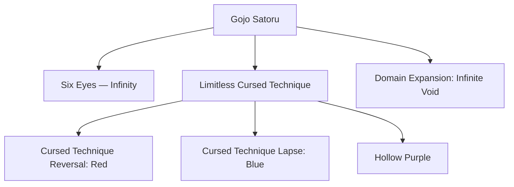

# ⚡ GOJO SATORU — YouTube Shorts & Reels Edit Production Pipeline

> **"Throughout Heaven and Earth, I alone am the Honored One."**

A complete, production-ready master blueprint for creating **viral Gojo Satoru YouTube Shorts & Instagram Reels** — high-energy manga × anime × realistic-art hybrid edits with phonk/dark synthwave audio, beat-synced transitions, and cinematic narration.

---

> [!CAUTION]
> ### 🚨 CRITICAL PRODUCTION RULES (READ BEFORE MAKING ANY EDIT)
>
> 1. **HYBRID ART MIX (Manga + Anime + Realistic AI Art)**:
>    - Every edit MUST seamlessly blend **3 visual layers**: raw black-and-white JJK manga panels, colorized MAPPA anime clips/frames, and hyper-realistic AI-generated Gojo art.
>    - Manga panels serve as **foreground masks / transition frames** that reveal moving anime or realistic art underneath.
>    - The mix should feel like Gojo is breaking out of the manga page into reality.
> 2. **BEAT-SYNCED EDITING (EVERY CUT ON THE BEAT)**:
>    - Every single hard cut, zoom, flash, and transition MUST land precisely on a bass drop, kick, or snare hit.
>    - Off-beat cuts kill the vibe instantly. Use waveform markers in your editor.
> 3. **9:16 VERTICAL FORMAT ONLY (1080×1920)**:
>    - All edits are vertical shorts. Never letterbox horizontal content — always reframe/crop to fill 9:16.
> 4. **15–30 SECOND SWEET SPOT**:
>    - Optimal retention. YouTube algorithm favors 90%+ completion rate. Keep it tight.
> 5. **LOOP-ENGINEERED ENDINGS**:
>    - The last frame must seamlessly connect to the first frame visually and audibly for infinite replay loops.
> 6. **UNIQUE STORIES PER EDIT (NEVER REPEAT)**:
>    - Each edit tells a different Gojo story/arc/moment. Never recycle the same narrative across edits.

---

## 📂 Project Folder Structure

```text
GOJO/
├── README.md                          # ← YOU ARE HERE (Master Production Bible)
├── PRODUCTION_GUIDE.md                # Step-by-step technical SOP for every edit
├── Gojo_Shorts_Stories.txt            # All edit scripts/stories (numbered)
│
├── assets/                            # Shared global assets
│   ├── manga_panels/                  # Raw JJK manga panel scans (B&W source art)
│   ├── anime_frames/                  # Extracted MAPPA anime keyframes & clips
│   ├── realistic_art/                 # AI-generated hyper-realistic Gojo art
│   ├── sfx/                           # Sound effects (bass drops, impacts, swooshes)
│   ├── music/                         # Phonk / dark synthwave beats (royalty-free)
│   ├── voiceover/                     # Voice clips / narration audio
│   └── fonts/                         # Bold impact fonts for kinetic text
│
├── edit_01/                           # Edit 1: "The Honored One Awakens"
│   ├── Gojo_Edit_01_Final.mp4         # Final rendered 9:16 short
│   ├── UPLOAD_GUIDE.md                # Copy-paste YouTube & Instagram kit
│   └── project_notes.md              # Scene breakdown & timestamps
│
├── edit_02/                           # Edit 2: "Infinite Void"
│   ├── Gojo_Edit_02_Final.mp4
│   ├── UPLOAD_GUIDE.md
│   └── project_notes.md
│
├── edit_03/                           # Edit 3: "Hollow Purple"
│   └── ... (same structure)
│
└── ... (edit_04, edit_05, etc.)
```

> [!IMPORTANT]
> **Every `edit_XX/` folder delivers exactly 3 clean files:**
> 1. `Gojo_Edit_XX_Final.mp4` — The finished 9:16 vertical edit
> 2. `UPLOAD_GUIDE.md` — Ready-to-paste titles, descriptions, tags, hashtags
> 3. `project_notes.md` — Scene breakdown, timestamps, asset references

---

## 👤 Character Model Sheet — Gojo Satoru



### Visual Identity (NEVER Deviate):

| Attribute | Specification |
|-----------|--------------|
| **Hair** | Spiky snow-white hair, swept upward, sharp defined strands |
| **Eyes (Blindfold OFF)** | Piercing electric **neon cyan/ice-blue** iris with concentric Six Eyes pattern, glowing intensity |
| **Eyes (Blindfold ON)** | Black satin blindfold wrapped around upper face, cocky smirk visible below |
| **Skin** | Fair, smooth, flawless complexion |
| **Build** | Tall (190cm / 6'3"), lean athletic build, broad shoulders |
| **Outfit (Jujutsu High)** | Dark navy/black Jujutsu High uniform jacket (high collar, zip front), matching dark pants, black shoes |
| **Outfit (Hidden Inventory)** | Round black sunglasses, casual black shirt, lighter jacket |
| **Aura Color** | **Neon cyan / electric sky-blue** glow radiating outward, white-hot plasma core |
| **Infinity VFX** | Translucent spherical distortion field, prismatic light refraction, geometric fractal grid lines |
| **Red (反転)** | Blazing **crimson-scarlet** compressed energy sphere, heat distortion, red particle embers |
| **Blue (蒼)** | Deep **ultramarine-indigo** gravitational pull orb, crushing implosion VFX, geometric fractures |
| **Hollow Purple (虚式「茈」)** | Massive swirling **violet-magenta** energy beam, reality-erasing white core, devastating trail |
| **Domain: Infinite Void** | Infinite black cosmos, floating geometric eyes everywhere, victim frozen in information overload |

### AI Image Generation Prompt Formula:
> `Gojo Satoru from Jujutsu Kaisen, spiky white hair, piercing glowing neon cyan Six Eyes, wearing dark navy jujutsu uniform with high collar, [SPECIFIC POSE/ACTION], intense electric blue aura radiating outward with white plasma core, [manga art style / realistic photorealistic / anime cel-shaded], dramatic cinematic volumetric lighting, 8k ultra detailed, 9:16 vertical composition`

---

## 🎨 Visual Style Bible — The 3-Layer Hybrid Mix

> [!IMPORTANT]
> **The signature look of a viral Gojo edit is the seamless fusion of 3 distinct visual media:**

### Layer 1: Raw Manga Panels (Black & White)
- **Source**: Jujutsu Kaisen manga by Gege Akutami
- **Usage**: Serve as **foreground masks, transition frames, and beat-synced flash panels**
- **Treatment**: High contrast B&W, sharp ink lines, screentone visible
- **Motion**: Ken Burns zoom/pan on static panels, parallax depth layers
- **Key Panels**: Six Eyes reveal, Hollow Purple launch, Domain hand gesture, Sukuna fight stances

### Layer 2: Anime Clips & Frames (Full Color Motion)
- **Source**: MAPPA's Jujutsu Kaisen anime (Season 1, Season 2, JJK 0 Movie)
- **Usage**: **Primary motion content** — the "alive" layer that manga panels transition into
- **Treatment**: Color-graded for high contrast, boosted saturation on blues/cyans, darkened shadows
- **Motion**: Real animated sequences, slo-mo keyframe extractions, speed ramps (0.25x → 4x)
- **Key Scenes**: Blindfold removal, Domain Expansion activation, Hollow Purple beam, Infinity showcase

### Layer 3: Realistic / AI-Generated Art
- **Source**: AI-generated hyper-realistic Gojo portraits and action poses
- **Usage**: **Impact hero frames** — single stunning images held for 1-2 seconds during narration peaks
- **Treatment**: Photorealistic lighting, cinematic depth-of-field, volumetric god-rays
- **Motion**: Slow dramatic zoom-in, subtle parallax, particle overlays
- **Purpose**: Makes the audience feel like Gojo exists in reality — the "wow" factor

### Blending Techniques:
```
┌────────────────────────────────────────────────────┐
│  MANGA PANEL (B&W)                                 │
│    ↓ [beat drop / bass hit]                        │
│  FLASH → COLOR ANIME CLIP (motion)                 │
│    ↓ [narration peak]                              │
│  ZOOM INTO REALISTIC ART (cinematic hold)           │
│    ↓ [beat drop]                                   │
│  SMASH CUT → NEXT MANGA PANEL                     │
│    ↓ [repeat cycle]                                │
└────────────────────────────────────────────────────┘
```

---

## 🎬 The Anatomy of a Perfect Gojo Edit (15-25s)

### Beat Map Template:

| Time | Beat | Visual | Audio | Text |
|------|------|--------|-------|------|
| 0.0s–0.5s | Pre-drop buildup | Slow zoom into manga panel close-up (Six Eyes / blindfold) | Low bass rumble + ticking clock + voice whisper | — |
| 0.5s–1.0s | **BEAT 1 (Hook)** | **FLASH → Anime clip** (blindfold removal / eye reveal) | **Bass drop + impact hit** | Kinetic text: character name or quote |
| 1.0s–3.0s | Verse 1 | Manga → anime → realistic art cycle (3-4 cuts) | Phonk beat flowing | Word-by-word narration captions |
| 3.0s–5.0s | Build-up | Speed ramp manga panels (fast cuts) | Rising tension in music | Quote text building |
| 5.0s–6.0s | **BEAT 2 (Drop)** | **Chromatic aberration + screen shake** → Hollow Purple / Domain | **Heavy bass drop + glass shatter SFX** | Impact quote: *"Nah, I'd win"* |
| 6.0s–12.0s | Main flow | Rapid manga/anime/realistic cycling, 2-3 cuts per beat | Full phonk beat, voice lines layered | Ongoing kinetic captions |
| 12.0s–14.0s | Final build | Slow zoom into Gojo's face (realistic art) | Music swelling + echo effect | Final quote loading... |
| 14.0s–15.0s | **BEAT 3 (Climax)** | **Flash to black** → Gojo smirk / silhouette | **Final bass hit → reverb tail** | *"I am the strongest."* |
| 15.0s+ | Loop point | Seamless cut back to opening frame | Audio loops cleanly | — |

---

## 🎵 Audio Architecture

### Music Selection:
| Priority | Genre | Mood | Example Vibe |
|----------|-------|------|-------------|
| 1st | **Drift Phonk** | Aggressive, dark, heavy bass, cowbell | KORDHELL, SHADXWBXRN |
| 2nd | **Dark Synthwave** | Cinematic, dystopian, electronic pulse | Perturbator, Carpenter Brut |
| 3rd | **Slowed + Reverb** | Hypnotic, atmospheric, bass-heavy | Slowed phonk remixes |
| 4th | **Orchestral Hybrid** | Epic, dramatic, emotional power | Two Steps from Hell style |

### Voice & SFX Layers:
- **Japanese Voice Lines**: Yuichi Nakamura as Gojo (iconic quotes with reverb + bass boost)
- **English Narration** (optional): Deep cinematic narrator describing Gojo's power
- **Impact SFX**: Sub-bass booms, metallic impacts, glass shattering, thunder cracks, energy charge-ups
- **Ambient SFX**: Wind howl, distant thunder, heartbeat, clock ticking

### Audio Mix Levels:
```
Music (Phonk Beat):        -6dB  (primary driver, NOT overpowering)
Voice Lines / Narration:    0dB  (loudest element when present)
Impact SFX:                -3dB  (punchy but not clipping)
Ambient SFX:              -18dB  (subtle atmospheric bed)
```

> [!WARNING]
> **Copyright Safety**: Use royalty-free phonk beats or beats with explicit YouTube Shorts licensing. For anime voice clips, keep them under 3 seconds each (fair use / transformative). Never use full copyrighted songs.

---

## ✨ Transitions & Effects Reference

| Effect | When to Use | How |
|--------|------------|-----|
| **Hard Cut** | Every beat drop | Instant frame swap, no easing |
| **White Flash (2-3 frames)** | Power activation / technique launch | 2-3 frame pure white overlay at 60% opacity |
| **Screen Shake** | Impact hits (punches, explosions) | 15-40px random X/Y offset, exponential decay over 5-8 frames |
| **Zoom Punch** | Beat drops | Quick 1.0→1.3x scale snap + ease-out over 4 frames |
| **Chromatic Aberration** | Domain Expansion / Hollow Purple | RGB channel split (R: -5px, B: +5px) for 3-5 frames |
| **Speed Ramp** | Action sequences | 0.25x slo-mo → snap to 3x fast-forward on beat |
| **B&W → Color Flash** | Manga-to-anime transitions | Desaturate to 0% → instant full saturation on beat |
| **Glitch / Data-mosh** | Cursed energy overload moments | 2-4 frame pixel displacement + color channel corruption |
| **Ken Burns (Slow Zoom + Pan)** | Manga panels / realistic art holds | Slow 1.0→1.15x zoom with gentle vertical pan over 3-5 seconds |
| **Light Leak / Lens Flare** | Six Eyes activation | Cyan/blue lens flare overlay, animated 1-second sweep |
| **Particle Overlay** | Aura / energy scenes | Floating blue energy particles, dust motes, ember sparks |
| **Vignette Pulse** | Tension building | Dark vignette edges pulsing to the beat |

---

## 📝 Edit Script Format

Every edit in `Gojo_Shorts_Stories.txt` follows this template:

```
============================================================

EDIT XXX — [TITLE IN CAPS]

Theme: [One-line thematic summary]
Mood: [dark / epic / emotional / hype / melancholic]
Duration: [15-25 seconds]
Music Vibe: [drift phonk / dark synthwave / orchestral]

SCENE 1 (0.0s - X.Xs): [HOOK]
Visual: [What appears on screen — manga panel / anime clip / realistic art]
Motion: [Zoom / pan / shake / flash / static]
Audio: [Bass rumble / voice line / SFX]
Text: [Any on-screen text or caption]

SCENE 2 (X.Xs - X.Xs): [ESCALATION]
...

SCENE 3 (X.Xs - X.Xs): [CLIMAX / DROP]
...

SCENE 4 (X.Xs - X.Xs): [RESOLUTION / LOOP POINT]
...

Narration (if any):
"[Full narration script with character thoughts]"

Key Manga Panels Needed:
- [Description of panel 1]
- [Description of panel 2]
...

Key Anime Moments Needed:
- [Scene description from specific episode/season]
...

Realistic Art Prompts:
- [AI generation prompt 1]
- [AI generation prompt 2]
...

============================================================
```

---

## 🚀 One-Command Production

To produce the next edit, simply say:

> *"Produce Edit [XX] into folder edit_XX following PRODUCTION_GUIDE.md"*

The agent will:
1. Extract the edit script from `Gojo_Shorts_Stories.txt`
2. Generate realistic AI art panels using the Character Model Sheet prompts
3. Assemble the 9:16 video with beat-synced transitions, effects, and text overlays
4. Mix audio (phonk beat + voice lines + SFX)
5. Write `UPLOAD_GUIDE.md` with optimized titles, descriptions, tags
6. Write `project_notes.md` with scene breakdown and timestamps
7. Clean up all intermediate files

---

## 🔖 Hashtag & Tag Strategy

### Primary Tags (Always Include):
```
#gojosatoru #gojo #jujutsukaisen #jjk #animeedit #mangaedit #shorts
```

### Secondary Tags (Rotate Per Edit):
```
#jjkedit #satorugojo #thehonoredone #sixeyes #infinitevoid #hollowpurple
#animeshorts #mangashorts #phonkedit #animetiktok #animereels
#gojovsukuna #jjkspoilers #cursedenergy #domainexpansion
#gojoedit #jjkseason2 #mappaanimation #shinjukushowdown
```

### Engagement Tags:
```
#anime #manga #otaku #weeb #fyp #viral #trending #edit #amv
```

---

## 📊 Reference Videos Analyzed

These viral Gojo edits were studied to reverse-engineer the production formula:

| # | URL | Key Takeaway |
|---|-----|-------------|
| 1 | [gA3K7IG-l-c](https://www.youtube.com/shorts/gA3K7IG-l-c) | Manga × anime × realistic 3-layer blend, phonk beat sync, Six Eyes cold open |
| 2 | [OI4nnW0YWlk](https://www.youtube.com/shorts/OI4nnW0YWlk) | Chromatic aberration on Domain Expansion, kinetic text popups, loop-engineered ending |
| 3 | [nFkzPPvcwvY](https://www.youtube.com/shorts/nFkzPPvcwvY) | Speed ramp technique (slo-mo → snap to fast), B&W-to-color flash on beat drops |
| 4 | [3ha_E8-4JJY](https://www.youtube.com/shorts/3ha_E8-4JJY) | Aggressive glitch transitions, sub-bass SFX layering, manga-as-mask compositing |
| 5 | [TP4fWjT9c7c](https://www.youtube.com/shorts/TP4fWjT9c7c) | Voice line reverb treatment, realistic art hero holds, vignette pulse to beat |

---

*Built for maximum viral retention on YouTube Shorts & Instagram Reels. Every edit is a standalone 15-25 second masterpiece.*
