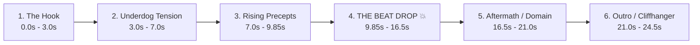

# 🔱 I KILLED AN ACADEMY PLAYER — YouTube Shorts & Reels Edit Production Pipeline

> **"The Chosen Player ruined everything. If the hero won't save this world, then an Extra will kill gods alone."**

A complete, production-ready master blueprint for creating **viral action manhwa YouTube Shorts & Instagram Reels** for *I Killed an Academy Player* (Korean: 아카데미 플레이어를 죽였다). High-energy AsuraScans webtoon visuals, beat-synced drift phonk audio, kinetic typography, glowing system interfaces, and seamless loop engineering.

---

## 🔗 Official Series Links & Chapter Source Architecture

- **Series Homepage**: `https://asurascans.com/comics/i-killed-an-academy-player-3ec3b16f`
- **Direct Chapter Format**: `https://asurascans.com/comics/i-killed-an-academy-player-3ec3b16f/chapter/{chapter_number}`
  - Example Chapter 4: `https://asurascans.com/comics/i-killed-an-academy-player-3ec3b16f/chapter/4`
- **Image CDN Base**: `https://cdn.asurascans.com/asura-images/chapters/i-killed-an-academy-player/{chapter_number}/{page_number:03d}.webp`
- **Chapter Extraction Method**:
  1. Fetch chapter HTML via `https://asurascans.com/comics/i-killed-an-academy-player-3ec3b16f/chapter/{chapter_number}`.
  2. Parse the embedded JSON `pages` array from the Astro script island to extract full continuous webtoon strips (`001.webp` to `NNN.webp`).
  3. Download high-resolution webtoon strips directly using `User-Agent: Mozilla/5.0` and `Referer: https://asurascans.com/`.
  4. Slice and crop authentic climax panels (spear strikes, eye flares, cold stares) with Pillow.
  5. Strictly eliminate all watermark logos, scanlation banners, and Discord credits.

---

## ⚡ The Standard Chapter Delivery Rule (Shephard Standard)

Every chapter folder (`chapterX/`) is automatically cleaned up and delivers **only 3 clean, essential files**:

```text
chapterX/
├── I_Killed_an_Academy_Player_Chapter_X_Edit.mp4        # 1. Full video WITH trending phonk/music
├── I_Killed_an_Academy_Player_Chapter_X_Edit_MUTED.mp4  # 2. Identical video WITHOUT music (Copyright-Safe)
└── UPLOAD_GUIDE.md                                      # 3. Complete copy-paste Instagram & YouTube pack
```

> [!IMPORTANT]
> **Zero Clutter & Zero AI Generation Rule**:
> 1. **STRICTLY NO AI GENERATED PANELS**: All visuals are authentic panels cut directly from the official AsuraScans webtoon strips.
> 2. **NO CLUTTER LEFT BEHIND**: All temporary raw chapter strips, intermediate slice crops, and tmp frame folders are automatically deleted after the final dual MP4s are compiled.

---

## 🎵 Dynamic Song Selection System

| Vibe / Story Scene | Trending Track | Artist | Drop Timestamp | Why it Works |
|---|---|---|---|---|
| **Awakening Sacred Precepts / Void Stare** | `metamorphosis.mp3` | INTERWORLD | **9.85s** | Dark, mystical synth lead that peaks into explosive drop |
| **Brutal Combat / Spear Combo Beatdown** | `murder_in_my_mind.mp3` | KORDHELL | **9.85s** (aligning from 7.04s) | Most viral phonk anthem; cowbell buildup into crushing 808 bass |
| **Ultra Instinct / Relentless Speed** | `live_another_day.mp3` | KORDHELL | **8.20s** | High-BPM aggression for fast-cut multi-strike sequences |
| **Underdog Flex / Disrespecting Nobility** | `close_eyes.mp3` | DVRST | **10.50s** | The quintessential Megamind / Chad meme soundtrack |
| **God Slayer / Royal Ascension** | `royalty.mp3` | Egzod x Maestro Chives | **12.00s** | Orchestral fantasy violin trap for epic grand-scale moments |

---

## 📐 Narrative Story Structure (22s – 26s Retention Formula)



### Phase Breakdown:
1. **The Hook (0.0s – 3.0s)**: Cold portrait or shocking panel (*"THE PLAYER IS DEAD"*, *"AN EXTRA WHO REJECTED DESTINY"*).
2. **The Underdog / Threat (3.0s – 7.0s)**: High-rank opponent or beast looming; Corin evaluates weaknesses.
3. **Pre-Drop Tension (7.0s – 9.85s)**: Sacred Precept chains ignite, spear readies, rapid pulse camera effect into drop.
4. **THE BEAT DROP 💥 (9.85s – 16.5s)**:
   - **Visual impact**: 5-frame decaying white flash (`0.85 * (1 - f/5)`) + 35px camera shake (`shake * exp(-3.5*t) * sin(f*2.5)`).
   - **Action**: Explosive spear strikes, golden sun runes, shattering impact.
5. **The Aftermath (16.5s – 21.0s)**: Crushed opponent / victorious glance with savage line (*"A SIDE CHARACTER'S VERDICT"*).
6. **The Outro & Cliffhanger (21.0s – 24.5s)**: Ominous cliffhanger stare or system window warning that loops back into the hook.

---

## 🎨 Visual Specifications & Typography

| Setting | Standard Value | Rationale |
|---|---|---|
| **Canvas** | `1080 x 1920` (9:16) | Native vertical standard for YouTube Shorts & Instagram Reels |
| **Frame Rate** | `30 FPS` | Fluid mobile playback |
| **Duration** | `22s – 26s` | Optimal APV (Average Percentage Viewed) completion weighting |
| **Background** | Ambient Gaussian-blurred panel | Fills the 9:16 frame seamlessly with organic palette |
| **Foreground** | Centered scaled crisp panel | Smooth zoom ease (`1.0` $\rightarrow$ `1.20`) |
| **Camera Shake** | `A * exp(-3.5 * t) * sin(f * 2.5)` | Organic impact vibration on beat drops and weapon impacts |
| **Transitions** | Decaying white flash | High-energy visual impact matching 808 snare/drop |
| **Subtitles** | Frosted glass pill | Translucent dark pill (`rgba(10,12,18,220)`), gold/cyan outline, placed at **`y = 1520`** (strictly clears mobile UI buttons) |
| **Letterbox** | 24px top & bottom black bars | Cinema look |
| **Font** | `Impact.ttf` (70pt) + `Arial Bold` (42pt) | Universal legible typography with high mobile contrast |

---

## 🎭 Character Profiles

### 1. Corin Locke (코린 로크)
- **Role**: Protagonist / Regressed Extra.
- **Weapon**: Silver Sun God Spear / Steel Combat Spear.
- **Aura & Visuals**: Fiery golden sun runes, runic chains of Lugh, sharp amber eyes, cold unwavering stare.

### 2. Park Sihu (박시후)
- **Role**: The Corrupted Player who doomed the previous timeline.
- **Visuals**: Blond, arrogant, collapsed and broken.

### 3. Marie Dunareff (마리 듀나레프)
- **Role**: Calm senior farm girl concealing pureblood vampire calamity power.
- **Visuals**: Auburn hair, crimson eyes, gentle smile hiding dark aura.

---

## 🛡️ Dual-Master Upload Protocol

1. **`I_Killed_an_Academy_Player_Chapter_X_Edit.mp4`**:
   - Master video with music mixed at 256kbps.
2. **`I_Killed_an_Academy_Player_Chapter_X_Edit_MUTED.mp4`**:
   - Master video with audio removed (`-an`).
   - Upload this file to YouTube Shorts & Instagram Reels, selecting the song in-app via **"Add Sound"** for:
     1. **0 Copyright Claims / Strikes**
     2. **Trending Sound Algorithm Exposure**
     3. **Full Monetization Eligibility**
