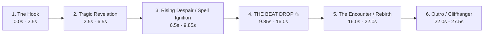

# 🎬 Automated Manhwa & Anime Short-Form Video Production Pipeline
## Series: My Slain Dragon Bride (양치기 마법사 / The Dragon Bride Who Killed Me)

A complete, repeatable, autonomous blueprint to turn *My Slain Dragon Bride* chapters into viral 9:16 vertical edits for **YouTube Shorts** and **Instagram Reels** with synchronized beat drops, dynamic camera motion, and zero copyright strikes.

---

## ⚡ The Standard Chapter Delivery Rule

Every chapter/arc folder (e.g. `chapter1_2/`) is automatically cleaned up and delivers **only 3 clean, essential files**:

```text
chapter1_2/
├── My_Slain_Dragon_Bride_Chapter_1_2_Edit.mp4        # 1. Full video WITH trending phonk/music
├── My_Slain_Dragon_Bride_Chapter_1_2_Edit_MUTED.mp4  # 2. Identical video WITHOUT music (Copyright-Safe)
└── UPLOAD_GUIDE.md                                   # 3. Complete copy-paste Instagram & YouTube pack
```

> [!IMPORTANT]
> **No clutter left behind**: All temporary raw pages, intermediate panel slices, contact sheets, and preview renders are kept in scratch and automatically purged after the edit is finalized.

> [!CRITICAL]
> **Pure Story Reel Standard (Zero Platform / Credit Cards)**: NEVER include scanlation title cards, Discord links, website URLs (e.g. AsuraScans), or "Chapter X Available Now!" credit slides in any form. Every edit must be a 100% immersive, cinema-grade story reel ending on a high-stakes manhwa cliffhanger panel that loops cleanly back to the opening hook.

---

## 🎵 Dynamic Song Selection System

Each video uses a distinct trending sound suited to the emotional and narrative tempo of the scene. Songs are never recycled lazily:

| Vibe / Story Scene | Trending Track | Artist | Beat Drop Alignment | Why it Works |
|---|---|---|---|---|
| **Tragic Regression / Dragon God Awakening** | `METAMORPHOSIS` | INTERWORLD | **9.85s** | Haunting bell melody transitioning into explosive dark phonk drop; perfect for regression & sacrifice |
| **Noble Standoff / Royal Challenge** | `Sahara` | Hensonn | **9.85s** | High energy dark Egyptian synth leads with aggressive 808s |
| **Pure Dominance / Demigod Flex** | `Close Eyes` | DVRST | **10.50s** | Legendary flex anthem |
| **High-Speed Sorcery / Combat Fury** | `Live Another Day` | KORDHELL | **8.20s** | 160 BPM relentless aggression |
| **Fantasy Royalty / Grand Destiny** | `Royalty` | Egzod x Maestro Chives | **12.00s** | Orchestral fantasy trap violin drop |

---

## 📐 Narrative Story Structure (25s – 28s Retention Formula)

To achieve 100%+ average retention rate on mobile feeds, every edit follows this 6-phase psychological curve:



### Phase Breakdown:
1. **The Hook (0.0s – 2.5s)**: Shocking scene — The Crimson Dragon Valdrova impaled, looking at Ian with sorrow (*"I never imagined my own fiancé would kill me..."*).
2. **Tragic Revelation (2.5s – 6.5s)**: Valdrova offers her heart without resisting. Ian realizes the horrific mistake (*"Why didn't you fight back?!"*).
3. **Spell Ignition (6.5s – 9.85s)**: Ian activates the forbidden 9th circle regression rite (*"Even if I burn my soul... I will undo this fate!"*).
4. **THE BEAT DROP 💥 (9.85s – 16.0s)**:
   - **Visual impact**: 5-frame decaying white flash (`0.85 * (1 - f/5)`) + 35px camera shake (`shake * exp(-3.5*t) * sin(f*2.5)`).
   - **Action**: Explosive golden chronos flash, time rewinds, Ian opens blazing eyes in his youthful body as a 1st circle mage!
5. **The Encounter / Rebirth (16.0s – 22.0s)**: Ian looks up to see the living Valdrova standing before him in the past, safe and breathing.
6. **The Outro & Cliffhanger (22.0s – 27.5s)**: Resolute vow (*"This time... I won't let you die."*).

---

## 🎨 Visual Specifications & Typography

| Setting | Standard Value | Rationale |
|---|---|---|
| **Canvas** | `1080 x 1920` (9:16) | Native vertical standard for YouTube Shorts, Instagram Reels & TikTok |
| **Frame Rate** | `30 FPS` | Fluid mobile playback without unnecessary file bloat |
| **Duration** | `26s – 28s` | Sweet spot for maximum loop/rewatch algorithmic weighting |
| **Background** | Ambient Gaussian-blurred panel | Fills the 9:16 frame seamlessly (eliminates black bars) |
| **Foreground** | Centered scaled crisp panel | `width = 1000px`, smooth zoom ease (`1.0` $\rightarrow$ `1.25`) |
| **Vertical Panning** | Smooth top-to-bottom pan | Used on tall action strips to show the entire attack arc |
| **Camera Shake** | `A * exp(-3.5 * t) * sin(f * 2.5)` | Organic impact vibration on beat drops and magic detonations |
| **Transitions** | Decaying white flash | 5-frame alpha composite for high-energy cuts |
| **Subtitles** | Frosted glass pill | Translucent black pill (`rgba(0,0,0,195)`), gold outline (`rgba(255,215,0,180)`), placed at **`y = 1520`** (strictly clears mobile UI buttons) |
| **Font** | `Impact.ttf` (72/92pt) + `Arial Bold` (44pt) | Standard fonts with zero missing-glyph/tofu box issues (Clean ASCII only) |

---

## 🛡️ Zero Copyright Strikes & Algorithm Boost Protocol

- **`My_Slain_Dragon_Bride_Chapter_X_Edit.mp4`**: Complete edit with pre-mixed music for local viewing and messaging apps.
- **`My_Slain_Dragon_Bride_Chapter_X_Edit_MUTED.mp4`**: Identical visual edit with zero audio track (`-an`). Upload this version and attach the song via in-app "Add Sound". Guarantees 0 copyright claims and gives algorithmic audio discovery.

---

## 📁 Repository Structure

```text
My Slain Dragon Bride/
├── README.md                                         # Master workflow & editing SOP (this file)
├── audio_cache/                                      # Reusable top 20 viral phonk audio library
│   ├── AUDIO_LIBRARY.json                            # Machine-readable metadata with beat drops & offsets
│   ├── AUDIO_LIBRARY.md                              # Human-readable audio catalog & sync guide
│   └── [20 trending MP3 tracks...]                   # Pre-analyzed phonk & action tracks
├── chapter1_2/                                       # Chapter 1 & 2 Combined Origin Hook
│   ├── My_Slain_Dragon_Bride_Chapter_1_2_Edit.mp4        # Edit with INTERWORLD - METAMORPHOSIS (Drop @ 9.85s)
│   ├── My_Slain_Dragon_Bride_Chapter_1_2_Edit_MUTED.mp4  # Clean muted edit for in-app sound tagging
│   └── UPLOAD_GUIDE.md                                   # Complete copy-paste Instagram & YouTube kit
├── chapter3/                                         # Chapter 3 - The Dragon Clan Trial
│   ├── My_Slain_Dragon_Bride_Chapter_3_Edit.mp4        # Edit with Hensonn - Sahara (Drop @ 9.85s)
│   ├── My_Slain_Dragon_Bride_Chapter_3_Edit_MUTED.mp4  # Clean muted edit for in-app sound tagging
│   └── UPLOAD_GUIDE.md                                   # Complete copy-paste Instagram & YouTube kit
└── chapter4/                                         # Chapter 4 - Mana Shot Reborn
    ├── My_Slain_Dragon_Bride_Chapter_4_Edit.mp4        # Edit with Twisted - Worth Nothing (Drop @ 9.85s)
    ├── My_Slain_Dragon_Bride_Chapter_4_Edit_MUTED.mp4  # Clean muted edit for in-app sound tagging
    └── UPLOAD_GUIDE.md                                   # Complete copy-paste Instagram & YouTube kit
```

