# 🎬 Random Movie Scenes — Step-by-Step Production Guide (SOP)

A repeatable standard operating procedure to produce every movie scene reel from script to upload-ready deliverable.

---

> [!CAUTION]
> ### 🚨 THE GOLDEN RULES
>
> 1. **HOOK IN 1.5 SECONDS**: Shocking visual + curiosity-gap voice line. NO slow intros.
> 2. **NARRATION DRIVES EVERYTHING**: Cuts follow voice pacing. Music follows voice energy.
> 3. **KINETIC CAPTIONS MANDATORY**: Word-by-word animated subtitles on EVERY reel. Viewers watch on mute.
> 4. **30-60 SECONDS**: Long enough to tell the story. Short enough for 90%+ completion.
> 5. **ROTATE INDUSTRIES & VOICES**: Never do the same industry/voice 2 reels in a row.
> 6. **LOOP THE ENDING**: Last frame connects to first frame for infinite replay.

---

## ⚡ Quick Start

```
"Produce Reel [XX] into folder reel_XX following PRODUCTION_GUIDE.md"
```

---

## 🛠️ Step-by-Step Technical Implementation

### Step 1: Script Selection & Narration Writing

From `Movie_Shorts_Scripts.txt`, extract the reel script for Reel XX.

**The narration script is the FIRST thing you write.** Everything else (clips, music, effects) follows the voice.

#### Narration Writing Rules:
1. **Opening line MUST be a hook** — question, shocking statement, or curiosity gap
2. **Keep sentences SHORT** — 5-12 words per sentence, never long paragraphs
3. **Conversational tone** — like telling a friend an insane story, not reading a textbook
4. **Build escalating drama** — each sentence more intense than the last
5. **End with an open loop** — question, cliffhanger, or CTA

#### Hook Templates (Copy & Adapt):

**Curiosity Gap:**
```
"This [duration] scene took [X months/years] to film... and what happened was INSANE."
"99% of people have NO idea what [Character] actually did in this scene."
"[Director] REFUSED to cut this scene... and it changed cinema forever."
```

**Shocking Statement:**
```
"This is the most disturbing scene in [genre] history."
"[Actor] almost DIED filming this scene."
"This scene was completely UNSCRIPTED... and it became the most iconic moment in the film."
```

**Challenge / Question:**
```
"Can you guess what [Character] does next? Nobody expected THIS."
"What would YOU do if you were in this situation?"
"Only 1% of viewers caught the hidden detail in THIS frame."
```

---

### Step 2: Voiceover Generation

#### Select the voice from README.md based on genre/mood:

```bash
# VOICE_M1: Deep cinematic male (English) — Action, Thriller, Gangster
edge-tts --voice "en-US-GuyNeural" --rate="+2%" --pitch="-2Hz" \
  -f narration_script.txt --write-media raw_voiceover.mp3

# VOICE_M2: Intense dramatic male (English) — Horror, Dark Twists
edge-tts --voice "en-US-DavisNeural" --rate="+4%" --pitch="-1Hz" \
  -f narration_script.txt --write-media raw_voiceover.mp3

# VOICE_F1: Smooth sultry female (English) — Mystery, Psychological, Emotional
edge-tts --voice "en-US-JennyNeural" --rate="+0%" --pitch="+1Hz" \
  -f narration_script.txt --write-media raw_voiceover.mp3

# VOICE_F2: Energetic girly female (English) — Fun Facts, Comedy, Upbeat
edge-tts --voice "en-US-AriaNeural" --rate="+5%" --pitch="+2Hz" \
  -f narration_script.txt --write-media raw_voiceover.mp3

# VOICE_H1: Deep dramatic male (Hindi)
edge-tts --voice "hi-IN-MadhurNeural" --rate="+2%" \
  -f narration_script.txt --write-media raw_voiceover.mp3

# VOICE_H2: Engaging female (Hindi)
edge-tts --voice "hi-IN-SwaraNeural" --rate="+3%" \
  -f narration_script.txt --write-media raw_voiceover.mp3
```

#### Post-Process Voice:
```bash
# Normalize, add warmth, compress, export
ffmpeg -i raw_voiceover.mp3 \
  -af "loudnorm=I=-14:TP=-3:LRA=7,equalizer=f=300:t=q:w=1:g=2,acompressor=threshold=-18dB:ratio=3:attack=5:release=50" \
  -ar 48000 voiceover_processed.wav
```

---

### Step 3: Movie Clip Sourcing & Preparation

#### 3A. Finding Clips
- **YouTube trailers** (official channels — best quality, most accessible)
- **Movie databases** (fan clips, scene compilations)
- **Screen recording** from streaming (personal reference only)

#### 3B. Downloading with yt-dlp
```bash
# Download a YouTube clip/trailer at best quality
yt-dlp -f "bestvideo[height<=1080]+bestaudio/best[height<=1080]" \
  --merge-output-format mp4 \
  -o "assets/clips/%(title)s.%(ext)s" \
  "YOUTUBE_URL_HERE"
```

#### 3C. Extracting Specific Scene
```bash
# Cut a specific scene from a longer video
ffmpeg -i full_movie_clip.mp4 \
  -ss 01:23:45 -t 00:00:30 \
  -c:v libx264 -c:a aac \
  scene_extract.mp4
```

#### 3D. Reframing to 9:16 Vertical

**Method 1: Center crop with blurred background (most common)**
```bash
ffmpeg -i scene_extract.mp4 \
  -filter_complex "\
    [0:v]scale=1080:1920:force_original_aspect_ratio=increase,crop=1080:1920,\
    boxblur=20:5,drawbox=0:0:1080:1920:black@0.5:fill[bg];\
    [0:v]scale=-1:720[fg];\
    [bg][fg]overlay=(W-w)/2:(H-h)/2[out]" \
  -map "[out]" -map 0:a \
  -c:v libx264 -c:a aac \
  scene_vertical.mp4
```

**Method 2: Ken Burns zoom-pan on character face**
```python
from PIL import Image, ImageFilter

def reframe_to_vertical(frame, focus_x=0.5, focus_y=0.4, zoom=1.15):
    """Convert 16:9 frame to 9:16 with blurred bg + centered crop"""
    W, H = 1080, 1920

    # Create blurred background
    bg = frame.resize((W, H), Image.LANCZOS)
    bg = bg.filter(ImageFilter.GaussianBlur(radius=20))
    # Darken
    from PIL import ImageEnhance
    bg = ImageEnhance.Brightness(bg).enhance(0.5)

    # Center the original frame
    fw, fh = frame.size
    scale = W / fw  # scale to fit width
    new_h = int(fh * scale)
    fg = frame.resize((W, new_h), Image.LANCZOS)

    # Paste centered
    y_offset = (H - new_h) // 2
    bg.paste(fg, (0, y_offset))

    return bg
```

---

### Step 4: Color Grading

Apply the appropriate LUT based on the movie's genre (from README.md):

```python
from PIL import Image, ImageEnhance

def color_grade_teal_orange(image):
    """Teal & Orange LUT — Hollywood action/thriller"""
    # Boost contrast
    image = ImageEnhance.Contrast(image).enhance(1.2)
    # Boost saturation
    image = ImageEnhance.Color(image).enhance(1.15)
    # Split channels and tint
    r, g, b = image.split()
    # Warm highlights (boost red slightly)
    r = r.point(lambda x: min(255, int(x * 1.05)))
    # Cool shadows (boost blue in darks)
    b = b.point(lambda x: min(255, int(x * 1.08)) if x < 128 else x)
    return Image.merge('RGB', (r, g, b))

def color_grade_cold_blue(image):
    """Cold Blue LUT — Horror, Korean thrillers"""
    image = ImageEnhance.Contrast(image).enhance(1.25)
    image = ImageEnhance.Color(image).enhance(0.9)  # Slightly desaturate
    r, g, b = image.split()
    r = r.point(lambda x: int(x * 0.9))   # Remove warmth
    b = b.point(lambda x: min(255, int(x * 1.15)))  # Boost blue
    return Image.merge('RGB', (r, g, b))

def color_grade_warm_sepia(image):
    """Warm Sepia — Emotional, romance, period"""
    image = ImageEnhance.Color(image).enhance(0.85)
    image = ImageEnhance.Brightness(image).enhance(1.05)
    r, g, b = image.split()
    r = r.point(lambda x: min(255, int(x * 1.1)))
    g = g.point(lambda x: min(255, int(x * 1.02)))
    b = b.point(lambda x: int(x * 0.88))
    return Image.merge('RGB', (r, g, b))
```

---

### Step 5: Kinetic Caption Generation

#### 5A. Timestamp Word Alignment
Use the voiceover audio to extract word-level timestamps:

```python
# Using edge-tts with word boundary events (or Whisper for alignment)
# Each word gets: (word, start_time_ms, end_time_ms)
word_timings = [
    ("This", 0, 200),
    ("scene", 200, 450),
    ("changed", 450, 780),
    ("cinema", 780, 1100),
    ("FOREVER", 1100, 1500),
    # ... etc
]
```

#### 5B. Rendering Captions
```python
from PIL import Image, ImageDraw, ImageFont

def render_kinetic_caption(draw, words, current_time_ms, canvas_width=1080, y_pos=1500):
    """Render word-by-word captions with highlight on current word"""

    font = ImageFont.truetype("assets/fonts/Montserrat-Black.ttf", 56)
    line_words = []  # Group into lines of max 5-6 words

    for word, start, end in words:
        if start <= current_time_ms:
            # Determine if this is the CURRENTLY spoken word
            is_current = (start <= current_time_ms <= end)
            is_key = word.isupper()  # ALL CAPS = key word

            if is_current:
                color = (255, 215, 0)  # Yellow highlight (#FFD700)
                scale = 1.1
            elif is_key:
                color = (255, 68, 68)  # Red for SHOCKING words
                scale = 1.0
            else:
                color = (255, 255, 255)  # White (already spoken)
                scale = 1.0

            # Draw with stroke
            draw.text(
                (canvas_width // 2, y_pos),
                word,
                font=font,
                fill=color,
                anchor='mt',
                stroke_width=3,
                stroke_fill=(0, 0, 0)
            )
```

---

### Step 6: Effects Implementation

#### Screen Shake:
```python
import math, random

def screen_shake(frame_index, total_frames=6, max_offset=25):
    """Exponentially decaying screen shake"""
    decay = math.exp(-frame_index / 2.0)
    x = int(random.uniform(-max_offset, max_offset) * decay)
    y = int(random.uniform(-max_offset, max_offset) * decay)
    return x, y
```

#### Zoom Punch:
```python
def zoom_punch(image, progress, max_zoom=1.3):
    """Quick snap zoom with ease-out"""
    if progress < 0.2:
        zoom = 1.0 + (max_zoom - 1.0) * (progress / 0.2)
    else:
        zoom = max_zoom - (max_zoom - 1.0) * ((progress - 0.2) / 0.8)
    w, h = int(image.width * zoom), int(image.height * zoom)
    zoomed = image.resize((w, h), Image.LANCZOS)
    left, top = (w - 1080) // 2, (h - 1920) // 2
    return zoomed.crop((left, top, left + 1080, top + 1920))
```

#### White Flash:
```python
def white_flash(base_image, intensity=0.5):
    """2-3 frame white overlay"""
    flash = Image.new('RGBA', base_image.size, (255, 255, 255, int(255 * intensity)))
    return Image.alpha_composite(base_image.convert('RGBA'), flash).convert('RGB')
```

#### Red Circle Zoom (Hidden Detail Highlight):
```python
def red_circle_highlight(draw, center_x, center_y, radius=80, thickness=4):
    """Animated red circle to highlight hidden details"""
    draw.ellipse(
        [center_x - radius, center_y - radius, center_x + radius, center_y + radius],
        outline=(255, 50, 50),
        width=thickness
    )
```

#### Whip Pan Transition:
```python
from PIL import ImageFilter

def whip_pan(frame_a, frame_b, progress):
    """Fast horizontal blur transition between two frames"""
    if progress < 0.5:
        # Blur frame A increasingly
        blur_amount = int(progress * 40)
        return frame_a.filter(ImageFilter.GaussianBlur(radius=blur_amount))
    else:
        # Unblur frame B
        blur_amount = int((1.0 - progress) * 40)
        return frame_b.filter(ImageFilter.GaussianBlur(radius=blur_amount))
```

---

### Step 7: Audio Mixing

```python
from pydub import AudioSegment

def mix_audio(voiceover_path, bgm_path, sfx_clips, movie_audio_path=None):
    """Mix all 4 audio tracks to final master"""

    # Load tracks
    voice = AudioSegment.from_file(voiceover_path)         # 0dB (loudest)
    bgm = AudioSegment.from_file(bgm_path) - 18            # -18dB (subtle bed)

    # Loop BGM to match voice length
    while len(bgm) < len(voice):
        bgm = bgm + bgm
    bgm = bgm[:len(voice)]

    # Start with voice + bgm mix
    master = voice.overlay(bgm)

    # Add movie audio if provided (during climax section)
    if movie_audio_path:
        movie_audio = AudioSegment.from_file(movie_audio_path) - 15  # -15dB
        # Overlay at the appropriate timestamp (climax section)
        # master = master.overlay(movie_audio, position=climax_start_ms)

    # Add SFX at specific timestamps
    for sfx_path, timestamp_ms, volume_adjust in sfx_clips:
        sfx = AudioSegment.from_file(sfx_path) + volume_adjust
        master = master.overlay(sfx, position=timestamp_ms)

    # Normalize and export
    master = master.normalize()
    master.export("audio_master.wav", format="wav")
    return master
```

---

### Step 8: Final Render

```bash
# Render with ffmpeg — YouTube Shorts optimized
ffmpeg -y -framerate 30 -i frames/frame_%04d.png \
  -i audio_master.wav \
  -c:v libx264 -preset slow -crf 18 \
  -c:a aac -b:a 192k \
  -pix_fmt yuv420p \
  -vf "scale=1080:1920" \
  -movflags +faststart \
  -shortest \
  -r 30 \
  Movie_Reel_XX_Final.mp4
```

**Quality targets:**
- Resolution: 1080×1920 (9:16)
- Codec: H.264 (libx264)
- CRF: 18 (high quality)
- Audio: AAC 192kbps
- Framerate: 30fps
- File size: Under 50MB

---

### Step 9: Upload Kit & Cleanup

#### 9A. Write `UPLOAD_GUIDE.md`
- 3 YouTube title options (hook-style, quote-style, challenge-style)
- YouTube description with scene teaser + hashtags
- YouTube tags
- Instagram Reels caption with CTA
- Thumbnail frame timestamp
- Pinned comment text
- Optimal posting schedule

#### 9B. Write `project_notes.md`
- Scene-by-scene breakdown with timestamps
- Source movie, clip timestamps, and credits
- Voice used, effects applied
- Asset file references

#### 9C. Clean Up
Remove all intermediate files. Leave only:
1. `Movie_Reel_XX_Final.mp4`
2. `UPLOAD_GUIDE.md`
3. `project_notes.md`

---

## 🔁 Repeatable Workflow

```mermaid
graph LR
    A[Write Script] --> B[Generate Voiceover]
    B --> C[Source Movie Clips]
    C --> D[Reframe to 9:16]
    D --> E[Color Grade]
    E --> F[Map Voice Timestamps]
    F --> G[Generate Captions]
    G --> H[Apply Effects]
    H --> I[Mix Audio]
    I --> J[Render MP4]
    J --> K[Write Upload Kit]
    K --> L[Clean Up]
    L --> M[✅ 3 Clean Files]
```



---

## 🎯 Quality Checklist (Before Delivery)

- [ ] Reel is 30-60 seconds (sweet spot)
- [ ] Hook hits within first 1.5 seconds (shocking visual + curiosity voice line)
- [ ] Narration is crystal clear and louder than everything else
- [ ] Kinetic captions present and synced word-by-word to voice
- [ ] Clips reframed to 9:16 (no black bars, no awkward crops)
- [ ] Color grading applied (appropriate LUT for genre)
- [ ] At least 2-3 transition effects (whip pan, zoom, flash, shake)
- [ ] Speed ramp used at least once (slo-mo → fast)
- [ ] Original movie dialogue plays during climax (if applicable)
- [ ] BGM appropriate for genre and not overpowering voice
- [ ] SFX accents on key impact moments
- [ ] Ends with CTA or question (drives comments)
- [ ] Last frame loops back to first frame
- [ ] No single movie clip longer than 5-8 seconds continuous
- [ ] Different industry/movie from previous reel
- [ ] Different voice from previous reel (or at least rotation)
- [ ] File size under 50MB
- [ ] `UPLOAD_GUIDE.md` has 3 title options + full kit
- [ ] All intermediate files cleaned up
