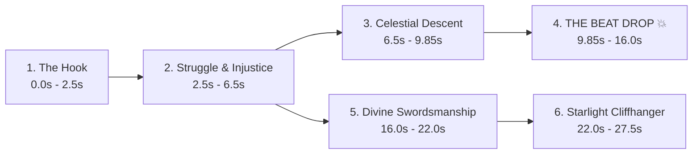

# 🎬 Automated Manhwa Short-Form Video Production Pipeline
## Series: Star-Embracing Swordmaster (별을 품은 소드마스터)

A complete, repeatable, autonomous blueprint to turn *Star-Embracing Swordmaster* chapters into viral 9:16 vertical edits for **YouTube Shorts** and **Instagram Reels** with synchronized beat drops, dynamic camera motion, and zero copyright strikes.

---

## ⚡ The Standard Chapter Delivery Rule

Every chapter or arc folder (e.g. `chapter1_5/`) is automatically cleaned up and delivers **only 3 clean, essential files**:

```text
chapter1_5/
├── Star_Embracing_Swordmaster_Chapter_1_5_Edit.mp4        # 1. Full video WITH trending music (Drop @ 9.85s)
├── Star_Embracing_Swordmaster_Chapter_1_5_Edit_MUTED.mp4  # 2. Identical video WITHOUT music (Copyright-Safe)
└── UPLOAD_GUIDE.md                                       # 3. Complete copy-paste Instagram & YouTube pack
```

> [!IMPORTANT]
> **No clutter left behind**: All temporary raw pages, intermediate panel slices, contact sheets, and preview renders are kept in scratch and automatically purged after the edit is finalized.

> [!CRITICAL]
> **Pure Story Reel Standard (Zero Platform / Credit Cards)**: NEVER include scanlation title cards, Discord links, website URLs (e.g. AsuraScans), or "Chapter X Available Now!" credit slides in any form. Every edit must be a 100% immersive, cinema-grade story reel ending on a high-stakes manhwa cliffhanger panel that loops cleanly back to the opening hook.

---

## 🎵 Dynamic Audio Library System (25 Curated Tracks)

Each video uses a distinct trending sound suited to the emotional and narrative tempo of the scene. Songs are never recycled lazily:

### High-Energy Phonk & Action Anthems (Combat / Dominance / Overpowered Moments)
| Track Title | Artist | Vibe / Emotional Tone | Drop @ | FFmpeg Offset | In-App Start |
|---|---|---|---|---|---|
| `Royalty` | Egzod, Maestro Chives, Neoni | Epic Fantasy / Orchestral Trap / Slum Boy to Knight | **27.09s** | `-ss 17.24` | **0:17** |
| `METAMORPHOSIS` | INTERWORLD | Haunting Bell Buildup / Regression & Awakening | **9.85s** | `-ss 0.00` | **0:00** |
| `Sahara` | Hensonn | Dark Phonk / Arabic Lead / Unstoppable Hype | **35.48s** | `-ss 25.63` | **0:25** |
| `Worth Nothing` | Twisted ft. Oliver Tree | Aggressive Anthem / High-Tension Clash | **41.13s** | `-ss 31.28` | **0:31** |
| `Murder In My Mind` | KORDHELL | Brutal Street Brawl / Cowbell Drop | **22.99s** | `-ss 13.14` | **0:13** |
| `Live Another Day` | KORDHELL | High-BPM Combat / Relentless Aggression | **39.68s** | `-ss 29.83` | **0:29** |
| `Close Eyes` | DVRST | Effortless Flex / Smooth Chad Phonk | **40.03s** | `-ss 30.18` | **0:30** |
| `NEON BLADE` | MoonDeity | Massive 808 Impact / God-Tier Rage | **21.54s** | `-ss 11.69` | **0:11** |

### Soft / Romance / Emotional Tracks (Love Factor / Bittersweet / Celestial Bonds)
| Track Title | Artist | Vibe / Emotional Tone | Drop @ | FFmpeg Offset | In-App Start |
|---|---|---|---|---|---|
| `golden hour` | JVKE | Heavenly Romance / Grand Piano Buildup / Euphoric Orchestral Drop | **59.10s** | `-ss 49.25` | **0:49** |
| `Romantic Homicide` | d4vd | Melancholic Love / Soft Electric Guitar / Bittersweet Drop | **34.20s** | `-ss 24.35` | **0:24** |
| `Here With Me` | d4vd | Warm Nostalgic Romance / Tender Acoustic Love / Sweet Embrace | **39.13s** | `-ss 29.28` | **0:29** |
| `Space Song` | Beach House | Celestial Dream Pop / Cosmic Starlight Romance | **34.60s** | `-ss 24.75` | **0:24** |
| `Until I Found You` | Stephen Sanchez | Timeless Retro Romance / Deep Emotional Vow | **32.50s** | `-ss 22.65` | **0:22** |

---

## 📐 Narrative Story Structure (25s – 28s Retention Formula)

To achieve 100%+ average retention rate on mobile feeds, every edit follows this 6-phase psychological curve:



### Phase Breakdown (Chapters 1–5 Origin Arc):
1. **The Hook (0.0s – 2.5s)**: Vlad, a bruised slum boy with a crude wooden sword, mocked as a "gutter rat" who can never become a knight.
2. **Struggle & Injustice (2.5s – 6.5s)**: Beaten down in the dirt, bleeding, yet looking up with unyielding, stubborn eyes (*"Even in the mud... I look at the stars."*).
3. **Celestial Descent (6.5s – 9.85s)**: A blinding celestial star streaks across the heavens and crashes before him (*"Will you perish in filth... or embrace the heavens?!"*).
4. **THE BEAT DROP 💥 (9.85s – 16.0s)**:
   - **Visual impact**: 5-frame decaying white flash (`0.85 * (1 - f/5)`) + 45px camera shake (`shake * exp(-3.5*t) * sin(f*2.5)`).
   - **Action**: Vlad grasps the fallen star! Blinding celestial starlight bursts through his veins, igniting a divine swordmaster aura!
5. **Divine Swordsmanship (16.0s – 22.0s)**: Vlad draws his blade bathed in cosmic starlight, unleashing a flawless supersonic sword slash that cleaves the darkness!
6. **Starlight Cliffhanger (22.0s – 27.5s)**: Vlad stands tall amidst the celestial glow as the knights of the citadel stare in paralyzed awe (*"Where did a slum boy learn such divine swordsmanship?!"*).

---

## 🎨 Visual Specifications & Typography

| Setting | Standard Value | Rationale |
|---|---|---|
| **Canvas** | `1080 x 1920` (9:16) | Native vertical standard for YouTube Shorts, Instagram Reels & TikTok |
| **Frame Rate** | `30 FPS` | Fluid mobile playback without unnecessary file bloat |
| **Duration** | `26s – 28s` | Sweet spot for maximum loop/rewatch algorithmic weighting |
| **Background** | Ambient Gaussian-blurred panel | Fills the 9:16 frame seamlessly (eliminates black bars) |
| **Foreground** | Centered scaled crisp panel | `width = 1000px`, smooth zoom ease (`1.0` $\rightarrow$ `1.25`) |
| **Vertical Panning** | Smooth top-to-bottom pan | Used on tall action strips to show the entire attack arc |
| **Camera Shake** | `A * exp(-3.5 * t) * sin(f * 2.5)` | Organic impact vibration on beat drops and magic detonations |
| **Transitions** | Decaying white flash | 5-frame alpha composite for high-energy cuts |
| **Subtitles** | Frosted glass pill | Translucent black pill (`rgba(0,0,0,195)`), gold outline (`rgba(255,215,0,180)`), placed at **`y = 1520`** (strictly clears mobile UI buttons) |
| **Font** | `Impact.ttf` (70pt) + `Arial Bold` (42pt) | Standard fonts with zero missing-glyph/tofu box issues (Clean ASCII only) |

---

## 🛡️ Zero Copyright Strikes & Algorithm Boost Protocol

- **`Star_Embracing_Swordmaster_Chapter_X_Edit.mp4`**: Complete edit with pre-mixed music for local viewing and messaging apps.
- **`Star_Embracing_Swordmaster_Chapter_X_Edit_MUTED.mp4`**: Identical visual edit with zero audio track (`-an`). Upload this version and attach the song via in-app "Add Sound". Guarantees 0 copyright claims and gives algorithmic audio discovery.

---

## 📁 Repository Structure

```text
Star-Embracing Swordmaster/
├── README.md                                               # Master workflow & editing SOP (this file)
├── audio_cache/                                            # Reusable 25-track phonk & romance audio library
│   ├── AUDIO_LIBRARY.json                                  # Machine-readable metadata & sync offsets
│   ├── AUDIO_LIBRARY.md                                    # Human-readable audio catalog & sync guide
│   └── [25 trending MP3 tracks...]                         # Pre-analyzed phonk, action & romance tracks
└── chapter1_5/                                             # Chapters 1 to 5 Origin Awakening Arc
    ├── Star_Embracing_Swordmaster_Chapter_1_5_Edit.mp4        # Edit with Royalty by Egzod (Drop @ 9.85s)
    ├── Star_Embracing_Swordmaster_Chapter_1_5_Edit_MUTED.mp4  # Clean muted edit for in-app sound tagging
    └── UPLOAD_GUIDE.md                                       # Complete copy-paste Instagram & YouTube kit
```
