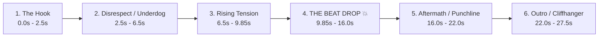

# 🎬 Automated Manhwa & Anime Short-Form Video Production Pipeline

A complete, repeatable, autonomous blueprint to turn any manhwa, webtoon, or anime chapter into viral 9:16 vertical edits for **YouTube Shorts** and **Instagram Reels** with synchronized beat drops, dynamic camera motion, and zero copyright strikes.

---

## ⚡ The Standard Chapter Delivery Rule

Every chapter folder (`chapterX/`) is automatically cleaned up and delivers **only 3 clean, essential files**:

```text
chapterX/
├── The_Shepherd_Wizard_Chapter_X_Edit.mp4        # 1. Full video WITH trending phonk/music
├── The_Shepherd_Wizard_Chapter_X_Edit_MUTED.mp4  # 2. Identical video WITHOUT music (Copyright-Safe)
└── UPLOAD_GUIDE.md                              # 3. Complete copy-paste Instagram & YouTube pack
```

> [!IMPORTANT]
> **No clutter left behind**: All temporary raw pages, intermediate panel slices, contact sheets, and preview renders are automatically purged after the edit is finalized.

---

## 🚀 One-Command Execution for Any Future Chapter or Anime

When you want to edit any new chapter or anime, simply prompt the agent:
> *"Create the edit for Chapter [X] into folder chapter[X] following README.md"*
>
> *(Or for another series: "Create an edit for [Series Name] Chapter [X] from [URL] into folder chapter[X] following README.md")*

The pipeline will autonomously handle scraping, slicing, story curation, song selection, dual rendering, guide writing, and clutter cleanup.

---

## 🎵 Dynamic Song Selection System

Do not use only one static track for every video. Select the viral sound that best matches the narrative mood and tempo of the chapter:

| Vibe / Story Scene | Trending Track | Artist | Drop Timestamp | Why it Works |
|---|---|---|---|---|
| **Brutal Street Brawl / Mob Beatdown** | `Murder In My Mind` | KORDHELL | **9.85s** (aligning audio from 7.04s) | Most viral phonk anthem (>1B streams); cowbell buildup into crushing 808 bass |
| **Aura / Secret Magic Reveal** | `Metamorphosis` | INTERWORLD | **9.85s** (from start) | Dark, mystical synth lead that peaks into explosive drop |
| **Effortless Flex / Chad MC** | `Close Eyes` | DVRST | **10.50s** | The quintessential Megamind / Chad meme soundtrack |
| **God-Tier Speed / Ultra Instinct** | `Live Another Day` | KORDHELL | **8.20s** | High-BPM aggression for fast-cut multi-strike sequences |
| **Tense Standoff / Boss Entrance** | `Royalty` | Egzod x Maestro Chives | **12.00s** | Orchestral fantasy violin trap for epic grand-scale moments |

### Beat Drop Detection Method:
To find the exact millisecond of a drop in any song:
1. Extract raw 16-bit mono audio with `ffmpeg`.
2. Compute RMS energy in 50ms chunks using NumPy: `rms = np.sqrt(np.mean(chunk**2))`.
3. Locate the point where `rms / prev_rms >= 3.0x`.
4. Offset the audio start (`-ss [offset]`) so that the spike lands precisely at **9.85s**.

---

## 📐 Narrative Story Structure (25s – 28s Retention Formula)

To achieve 100%+ average retention rate on mobile feeds, every edit follows this 6-phase psychological curve:



### Phase Breakdown:
1. **The Hook (0.0s – 2.5s)**: Shocking frame (blood on face, cold glare) + high-curiosity statement (*"I AM A WIZARD"*, *"Eight years hiding his power"*).
2. **The Disrespect / Underdog (2.5s – 6.5s)**: Mob or monster arrives; MC yawns or ignores them (*"*YAWN* - Zero respect given"*).
3. **Pre-Drop Tension (6.5s – 9.85s)**: Enemy launches an attack; MC remains calm, prepares spell (*"Magic is convenient"*).
4. **THE BEAT DROP 💥 (9.85s – 16.0s)**:
   - **Visual impact**: 5-frame decaying white flash (`0.85 * (1 - f/5)`) + 35px camera shake (`shake * exp(-3.5*t) * sin(f*2.5)`).
   - **Action**: Explosive strike, multi-hit combo, weapons shattered in midair, ultra-instinct dodge.
5. **The Aftermath (16.0s – 22.0s)**: All enemies unconscious on the ground; savage one-liner (*"Save that strength for the funeral"*).
6. **The Outro & Cliffhanger (22.0s – 27.5s)**: A new mysterious entity arrives or lethal stare cliffhanger (*"To protect his secret... he will kill"*).

---

## 🎨 Visual Specifications & Typography

| Setting | Standard Value | Rationale |
|---|---|---|
| **Canvas** | `1080 x 1920` (9:16) | Native vertical standard for YouTube Shorts, Instagram Reels & TikTok |
| **Frame Rate** | `30 FPS` | Fluid mobile playback without unnecessary file bloat |
| **Duration** | `26s – 28s` | Sweet spot for maximum loop/rewatch algorithmic weighting |
| **Background** | Ambient Gaussian-blurred panel | Fills the 9:16 frame seamlessly (eliminates black bars) |
| **Foreground** | Centered scaled crisp panel | `width = 1000px`, smooth zoom ease (`1.0` $\rightarrow$ `1.25`) |
| **Vertical Panning** | Smooth top-to-bottom pan | Used on tall action strips to show the entire attack arc |
| **Camera Shake** | `A * exp(-3.5 * t) * sin(f * 2.5)` | Organic impact vibration on beat drops and punches |
| **Transitions** | Decaying white flash | 5-frame alpha composite for high-energy cuts |
| **Subtitles** | Frosted glass pill | Translucent black pill (`rgba(0,0,0,195)`), gold outline (`rgba(255,215,0,180)`), placed at **`y = 1520`** (strictly clears mobile UI buttons) |
| **Font** | `Impact.ttf` (72/92pt) + `Arial Bold` (44pt) | Standard fonts with zero missing-glyph/tofu box issues |

---

## 🛡️ Zero Copyright Strikes & Algorithm Boost Protocol

Why we produce two video versions:

### Version 1: `The_Shepherd_Wizard_Chapter_X_Edit.mp4` (With Song)
- Complete self-contained edit with pre-mixed music.
- Perfect for offline viewing, sending to friends, or platforms without in-app sound libraries.

### Version 2: `The_Shepherd_Wizard_Chapter_X_Edit_MUTED.mp4` (Recommended for Upload)
- Identical visual edit with zero audio track (`-an`).
- When uploading to **YouTube Shorts** or **Instagram Reels**, you select the official song using the in-app **"Add Sound"** search.
- **Benefits**:
  1. **0 Copyright Claims or Strikes**: The music is officially licensed by YouTube / Meta.
  2. **Monetization Safe**: No revenue diversion.
  3. **Viral Audio Boost**: The video appears under the trending audio page, driving thousands of passive viewers from everyone listening to that sound.

---

## 📋 The `UPLOAD_GUIDE.md` Standard

Each chapter's `UPLOAD_GUIDE.md` must provide instant copy-paste assets:
- **Audio Search Keywords**: Exact song title & artist.
- **3 High-CTR Title Options**: Curiosity hook, action quote, and chapter keyword format.
- **YouTube Description & Tags**: Formatted with keywords and trending tags.
- **Instagram Caption & Hashtags**: Hook opening line, engaging narrative, and 15–20 high-traffic hashtags.
- **Thumbnail Advice**: Exact timestamp to select for the cover (the beat drop impact frame).
- **Posting Strategy**: Best times (4:00 PM – 8:00 PM local) and engagement-boosting pinned comment.

---

## 📁 Repository Structure Overview

```text
shephard/
├── README.md                                         # Master workflow & editing SOP (this file)
├── audio_cache/                                      # Reusable viral phonk audio library
├── chapter1/                                         # Chapter 1 archives & edits
│   ├── The_Shepherd_Wizard_Chapter_1_Edit.mp4
│   ├── The_Shepherd_Wizard_Chapter_1_Edit_MUTED.mp4
│   └── ...
├── chapter2/                                         # Clean Chapter 2 production folder
│   ├── The_Shepherd_Wizard_Chapter_2_Edit.mp4        # Edit with KORDHELL - Murder In My Mind
│   ├── The_Shepherd_Wizard_Chapter_2_Edit_MUTED.mp4  # Clean muted edit for in-app sound tagging
│   └── UPLOAD_GUIDE.md                               # Complete copy-paste Instagram & YouTube kit
├── chapter3/                                         # Clean Chapter 3 production folder
│   ├── The_Shepherd_Wizard_Chapter_3_Edit.mp4        # Edit with DVRST - Close Eyes
│   ├── The_Shepherd_Wizard_Chapter_3_Edit_MUTED.mp4  # Clean muted edit for in-app sound tagging
│   └── UPLOAD_GUIDE.md                               # Complete copy-paste Instagram & YouTube kit
└── chapter4/                                         # Clean Chapter 4 production folder
    ├── The_Shepherd_Wizard_Chapter_4_Edit.mp4        # Edit with KORDHELL - Live Another Day
    ├── The_Shepherd_Wizard_Chapter_4_Edit_MUTED.mp4  # Clean muted edit for in-app sound tagging
    └── UPLOAD_GUIDE.md                               # Complete copy-paste Instagram & YouTube kit
```

