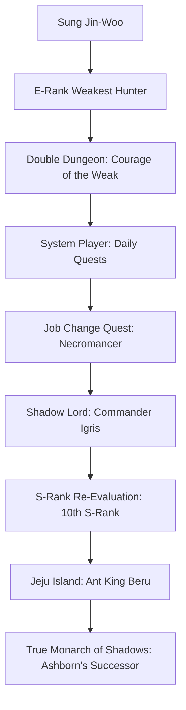

# ⚡ SOLO LEVELING (나 혼자만 레벨업) — YouTube Shorts & Reels Edit Production Pipeline

> **"ARISE." (일어나라) — The world trembled when the Weakest Hunter became the God of Death.**

A complete, production-ready master blueprint for creating **viral Solo Leveling YouTube Shorts & Instagram Reels** — high-energy manhwa × anime × realistic AI hybrid edits with drift phonk audio, beat-synced transitions, glowing shadow monarch auras, and iconic Korean battle quotes.

---

> [!CAUTION]
> ### 🚨 CRITICAL PRODUCTION RULES (READ BEFORE MAKING ANY EDIT)
>
> 1. **HYBRID ART MIX (Manhwa + Anime + Realistic AI Art)**:
>    - Every edit MUST seamlessly blend **3 visual layers**: raw black-and-white / ink webtoon panels, colorized A-1 Pictures anime clips/frames, and hyper-realistic AI-rendered Shadow Monarch art.
>    - Raw ink panels serve as **foreground masks / transition frames** that reveal moving animated sequences or realistic art underneath.
>    - The visual style should feel like Sung Jin-Woo is breaking out of the webtoon panel into terrifying reality.
> 2. **BEAT-SYNCED EDITING (EVERY CUT ON THE BEAT)**:
>    - Every single hard cut, punch zoom, flash, and transition MUST land precisely on a bass drop, kick, or snare hit of trending phonk beats.
>    - Off-beat cuts kill the hype instantly. Use waveform markers for millisecond precision.
> 3. **9:16 VERTICAL FORMAT ONLY (1080×1920)**:
>    - All edits are vertical shorts. Never letterbox or pillarbox horizontal content — always crop, reframe, and zoom to fill 9:16 completely.
> 4. **18–25 SECOND SWEET SPOT**:
>    - Optimal retention. The YouTube Shorts and Instagram algorithms heavily prioritize videos with >100% completion rates.
> 5. **LOOP-ENGINEERED ENDINGS**:
>    - The final frame and audio fade must seamlessly reconnect to the initial scene, enabling endless viewer replay loops.
> 6. **KINETIC IMPACT TYPOGRAPHY & SYSTEM HUD**:
>    - Use bold Impact or Arial Black typography encased in sleek dark UI pill badges (`#05080F` with `#00F0FF` neon cyan borders) styled directly after the System Status Screen.

---

## 📂 Project Folder Structure

```text
solo leveling/
├── README.md                          # ← YOU ARE HERE (Master Production Bible)
├── PRODUCTION_GUIDE.md                # Step-by-step SOP for short-form production
├── Solo_Leveling_Shorts_Stories.txt   # 10 Full Storyboard Scripts (Numbered 1–10)
├── AGENTS.md                          # Repository operating constraints
│
├── assets/                            # Global shared assets
│   ├── anime_frames/                  # Extracted 1080x1920 high-res anime & manhwa panels
│   ├── music/                         # Curated phonk tracks (NEON BLADE, Metamorphosis, etc.)
│   ├── sfx/                           # Bass drops, shadow soundscapes, heartbeat thuds
│   └── fonts/                         # Impact.ttf, ArialBold.ttf
│
├── random_shot_1/                     # Master Shot 1: "The Monarch Awakens"
│   ├── Solo_Leveling_Random_Shot_1_Edit.mp4       # Full Audio Master (21.0s)
│   ├── Solo_Leveling_Random_Shot_1_Edit_MUTED.mp4 # Clean Muted Master for in-app sound
│   ├── UPLOAD_GUIDE.md                # Copy-paste YouTube & Instagram Kit
│   ├── project_notes.md               # Storyboard cue sheet & camera math
│   ├── render_random_shot_1.py        # Autonomous Python render engine
│   └── panels/                        # 7 Graded 1080x1920 action panels
│
└── random shot 1/                     # Symlink alias for universal path access
```

> [!IMPORTANT]
> **Every `random_shot_XX/` folder delivers strictly clean, self-contained files:**
> 1. `Solo_Leveling_Random_Shot_XX_Edit.mp4` — The finished 9:16 vertical edit with synced phonk audio.
> 2. `Solo_Leveling_Random_Shot_XX_Edit_MUTED.mp4` — Clean muted version for in-app TikTok / Reels sound selection.
> 3. `UPLOAD_GUIDE.md` — Ready-to-paste titles, descriptions, tags, hashtags, and pinned comment.
> 4. `project_notes.md` — Scene breakdown, timestamps, camera math, and color grading.

---

## 👤 Character Model Sheet — Sung Jin-Woo (성진우)



### Visual Identity (NEVER Deviate):

| Attribute | Specification |
|-----------|--------------|
| **Hair** | Jet-black messy hair, sharp bangs falling across eyes, wind-swept during combat |
| **Eyes (Normal State)** | Dark grey/black calm, observant, sharp predator gaze |
| **Eyes (Awakened / Combat)** | Piercing **electric neon cyan / glowing sky-blue** iris trailing radiant blue plasma particles |
| **Eyes (Monarch of Death)** | Deep **amethyst-violet / cosmic purple** flame flaring from pupils |
| **Build** | Tall (188cm / 6'2"), lean athletic muscular build, wide shoulders, black combat gloves |
| **Outfit (Hunter D-Rank)** | Casual hoodie, worn jeans, basic iron dagger |
| **Outfit (Monarch S-Rank)** | Long black tailored trench coat with high collar, dark trousers, steel belt buckles, coat hem billowing with purple shadow mist |
| **Daggers** | **Rasaka's Fang** (bone white, paralytic poison), **Knight Killer** (serrated steel), **Demon King's Shortsword** (white lightning crackle) |
| **Aura Color** | **Electric Cyan** (`#00F0FF`) inner core wrapped in **Deep Shadow Purple** (`#9B30FF`) and pitch-black smoke (`#0A0614`) |
| **Shadow Extraction VFX** | Pitch-black bubbling abyss pools on the ground, ghostly purple hands reaching upward, towering smoke plumes |
| **Ruler's Authority** | Translucent vibrant **azure-blue gravitational distortion wave**, lifting tons of debris telekinetically |
| **The "ARISE" Command** | Screen desaturates to pitch-black, Jin-Woo's blue eye flares, single word in Korean / English, followed by cataclysmic 808 shockwave |

### AI Image Generation Prompt Formula:
> `Sung Jin-Woo from Solo Leveling, messy black hair, piercing glowing neon cyan blue eyes radiating electric light trails, wearing long black stylish trench coat with high collar, [SPECIFIC ACTION / POSE], dark violet and cyan shadow flame aura billowing around him, shadow soldiers rising from ground, dramatic cinematic volumetric lighting, 8k ultra detailed, 9:16 vertical composition`

---

## 🎨 Visual Style Bible — The 3-Layer Hybrid Mix

> [!IMPORTANT]
> **The signature aesthetic of a viral Solo Leveling edit fuses 3 visual layers:**

### Layer 1: Raw Webtoon / Manhwa Panels (Black Ink & Stylized Linework)
- **Source**: DUBU (REDICE Studio) *Solo Leveling* original manhwa.
- **Usage**: Foreground masks, dramatic reaction flashes, and fast cut impact frames.
- **Treatment**: Extreme contrast, razor-sharp ink hatching, motion speed lines.
- **Motion**: Snap zooms into Jin-Woo’s eyes or blade reflections.

### Layer 2: Anime Clips & Motion Frames (A-1 Pictures)
- **Source**: A-1 Pictures *Solo Leveling* anime adaptation.
- **Usage**: Primary fluid action sequences — dagger slashes, acrobatic dodges, glowing eye trails in motion.
- **Treatment**: Color graded with darkened shadows and saturated neon cyans.
- **Motion**: Speed ramping (0.3x slo-mo during jump → 3.0x snap acceleration on dagger thrust).

### Layer 3: Hyper-Realistic AI & 3D Aura Renderings
- **Source**: Ultra-detailed photorealistic portraits of Sung Jin-Woo and Commander Igris.
- **Usage**: Impact hero frames held for 1.5–2.0 seconds during narration peaks and beat drops.
- **Treatment**: Photorealistic volumetric lighting, floating magical embers, cinematic depth-of-field.
- **Purpose**: Creates the "wow" factor that stops viewers mid-scroll.

---

## 🎬 The Anatomy of a Perfect Solo Leveling Edit (18–25s)

### Beat Map Template:

| Time | Beat Phase | Visual Layer | Audio Element | Kinetic Caption |
|------|------------|--------------|---------------|-----------------|
| **0.0s – 1.0s** | Eerie Pre-Drop | Slow push-in on Jin-Woo in darkness / dead rival | Menacing phonk cowbells + low sub-bass rumble | `[ THE WEAKEST HUNTER IS DEAD ]` |
| **1.0s – 4.0s** | Escalation | Manhwa ink panels cycling into anime close-up | Driving cowbell lead; dark synth pad | `[ CLASS: SHADOW MONARCH ]` |
| **4.0s – 7.5s** | Tension Build | Rapid cuts of enemy terror / boss monster preparing to strike | Rising snare rolls + heartbeat thuds | `WHO IS THE REAL PREDATOR?` |
| **7.5s – 9.85s** | The Pre-Drop Silence | Extreme close-up of Jin-Woo's lips; eye flares white | Music cuts out; reverse cymbal sweep; whisper: *"Arise"* | 4-frame white flash ramp |
| **09.85s** | **💥 BEAT DROP IMPACT** | **Violent Screen Shake (±35px) + Chromatic Aberration** | **GIGANTIC 808 BASS DROP & PHONK LEAD** | `ARISE : 일어나라` |
| **9.85s – 15.0s** | Shadow Legion Run | Shadow soldiers (Igris, Beru, Iron) erupting from ground in purple fire | Driving phonk rhythm; sub-bass impact hits | `[ EXTRACT EVERY LAST SOUL! ]` |
| **15.0s – 19.5s** | Climax Stride | Jin-Woo stepping forward with twin glowing daggers and billowing coat | Full soaring phonk melody; cosmic sub-bass | `[ I ALONE LEVEL UP ]` |
| **19.5s – 21.0s** | Loop Outro | Seamless cut transition back into opening darkness | Smooth audio fade-out into loop | `SOLO LEVELING` |

---

## 🎵 Audio Architecture

### Phonk Track Hierarchy:
1. **MoonDeity – NEON BLADE**: Cyberpunk phonk with massive 808 sub-bass. The undisputed global anthem of Sung Jin-Woo edits.
2. **INTERWORLD – METAMORPHOSIS**: Haunting bells and regression tension. Ideal for Double Dungeon and Job Change arcs.
3. **KORDHELL – Murder In My Mind**: Relentless cowbell aggression for brutal boss massacres (Jeju Island / Red Gate).
4. **MoonDeity – Wake Up!**: Tremor bass drops for Demon King Baran and Architect encounters.

### Audio Mix Standards:
```text
Phonk Beat Track:          -6dB   (Driving rhythm, punchy, unclipped)
Voice Drops ("Arise"):      0dB   (Crisp, prominent, slight reverb tail)
Sub-Bass Impacts:          -3dB   (Clean 40Hz–60Hz low-end rumble)
Atmospheric SFX:          -18dB   (Wind howl, heartbeat, energy crackle)
```

---

## ✨ Transitions & Effects Reference

| Effect | Timing | Technical Implementation |
|---|---|---|
| **Hard Beat Cut** | Every snare/kick | Instantaneous frame swap without easing |
| **Screen Shake** | 808 Bass drop & hits | Sinusoidal displacement (`dx = sin(t)*35`, `dy = cos(t)*30`) with exponential decay over 1.2s |
| **Chromatic Aberration** | "Arise" drop | RGB split (`R: -6px`, `B: +6px`) across 4 frames |
| **White Flash** | Power activation | 3-frame 255-alpha white overlay fading to zero |
| **Speed Ramp** | Weapon slashes | 0.25x slow-mo snapped into 3.0x acceleration on hit |
| **Electric Eye Bloom** | Eye flare | Dual-pass blur + additive blending on cyan iris (`#00F0FF`) |
| **Vignette Darkening** | Pre-drop tension | Radial alpha gradient darkening corners by 60% |

---

## 🔖 Hashtag & SEO Strategy

### Primary Tags (Always Include):
```text
#sololeveling #sungjinwoo #sololevelinganime #animeedit #mangaedit #arise #shorts
```

### Secondary Tags (Rotate Per Edit):
```text
#shadowmonarch #igris #beru #phonkedit #neonblade #jinwoo #sololevelingedit
#animeshorts #manhwa #webtoon #manhwaedit #sololevelingmanhwa #animereels
#animetiktok #amv #fyp #viral #trending
```

---

## 📊 Reference Videos Analyzed

| # | Viral Concept | Key Formula |
|---|---|---|
| 1 | **Shadow Monarch Cold Open** | 3-second buildup with ticking clock → sudden whisper → 808 explosion |
| 2 | **"ARISE" Screen Shake** | Violent lateral vibration synchronized with Korean voice line *일어나라* |
| 3 | **Electric Cyan Eye Trails** | High-contrast black background with glowing blue light streaks |
| 4 | **Loop-Engineered Stride** | Jin-Woo walking toward camera seamlessly looping into the opening panel |

---

*Built for maximum viral retention on YouTube Shorts, Instagram Reels & TikTok. Every edit delivers a standalone, high-octane 18–25 second masterpiece.*
